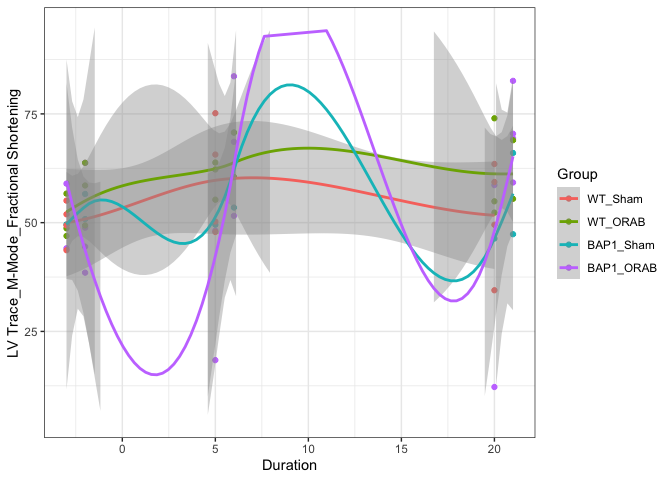

This script contains the coding needed to import, clean, visualize, and analyze echocardiographic data.

## Clean raw data from Echocardiography tracings.

The reports (.csv) generated from the Echo software produces a poorly-formatted sheet of information that needs to be parsed to extract phenotypic parameters. This function looks within all sub-directories for the echo reports (".csv"), and compiles them. Once compiled, this table is exported as "**Master_Table.xlsx**" in the same directory where the script is run.


```
## 
## Attaching package: 'dplyr'
```

```
## The following objects are masked from 'package:plyr':
## 
##     arrange, count, desc, failwith, id, mutate, rename, summarise,
##     summarize
```

```
## The following objects are masked from 'package:stats':
## 
##     filter, lag
```

```
## The following objects are masked from 'package:base':
## 
##     intersect, setdiff, setequal, union
```

```
## ── Attaching packages ─────────────────────────────────────── tidyverse 1.3.0 ──
```

```
## ✓ ggplot2 3.3.3     ✓ purrr   0.3.4
## ✓ tibble  3.1.0     ✓ stringr 1.4.0
## ✓ readr   1.4.0     ✓ forcats 0.5.1
```

```
## ── Conflicts ────────────────────────────────────────── tidyverse_conflicts() ──
## x dplyr::arrange()   masks plyr::arrange()
## x purrr::compact()   masks plyr::compact()
## x dplyr::count()     masks plyr::count()
## x dplyr::failwith()  masks plyr::failwith()
## x dplyr::filter()    masks stats::filter()
## x dplyr::id()        masks plyr::id()
## x dplyr::lag()       masks stats::lag()
## x dplyr::mutate()    masks plyr::mutate()
## x dplyr::rename()    masks plyr::rename()
## x dplyr::summarise() masks plyr::summarise()
## x dplyr::summarize() masks plyr::summarize()
```

```
## Joining, by = c("Echo_Param", "Dates")
## Joining, by = c("Echo_Param", "Dates")
## Joining, by = c("Echo_Param", "Dates")
## Joining, by = c("Echo_Param", "Dates")
## Joining, by = c("Echo_Param", "Dates")
## Joining, by = c("Echo_Param", "Dates")
## Joining, by = c("Echo_Param", "Dates")
## Joining, by = c("Echo_Param", "Dates")
## Joining, by = c("Echo_Param", "Dates")
## Joining, by = c("Echo_Param", "Dates")
## Joining, by = c("Echo_Param", "Dates")
## Joining, by = c("Echo_Param", "Dates")
## Joining, by = c("Echo_Param", "Dates")
## Joining, by = c("Echo_Param", "Dates")
## Joining, by = c("Echo_Param", "Dates")
## Joining, by = c("Echo_Param", "Dates")
## Joining, by = c("Echo_Param", "Dates")
## Joining, by = c("Echo_Param", "Dates")
## Joining, by = c("Echo_Param", "Dates")
## Joining, by = c("Echo_Param", "Dates")
## Joining, by = c("Echo_Param", "Dates")
## Joining, by = c("Echo_Param", "Dates")
## Joining, by = c("Echo_Param", "Dates")
## Joining, by = c("Echo_Param", "Dates")
## Joining, by = c("Echo_Param", "Dates")
## Joining, by = c("Echo_Param", "Dates")
## Joining, by = c("Echo_Param", "Dates")
## Joining, by = c("Echo_Param", "Dates")
## Joining, by = c("Echo_Param", "Dates")
## Joining, by = c("Echo_Param", "Dates")
## Joining, by = c("Echo_Param", "Dates")
## Joining, by = c("Echo_Param", "Dates")
## Joining, by = c("Echo_Param", "Dates")
## Joining, by = c("Echo_Param", "Dates")
## Joining, by = c("Echo_Param", "Dates")
## Joining, by = c("Echo_Param", "Dates")
## Joining, by = c("Echo_Param", "Dates")
## Joining, by = c("Echo_Param", "Dates")
## Joining, by = c("Echo_Param", "Dates")
## Joining, by = c("Echo_Param", "Dates")
## Joining, by = c("Echo_Param", "Dates")
## Joining, by = c("Echo_Param", "Dates")
## Joining, by = c("Echo_Param", "Dates")
## Joining, by = c("Echo_Param", "Dates")
## Joining, by = c("Echo_Param", "Dates")
## Joining, by = c("Echo_Param", "Dates")
## Joining, by = c("Echo_Param", "Dates")
## Joining, by = c("Echo_Param", "Dates")
## Joining, by = c("Echo_Param", "Dates")
## Joining, by = c("Echo_Param", "Dates")
## Joining, by = c("Echo_Param", "Dates")
## Joining, by = c("Echo_Param", "Dates")
```

```
## Joining, by = c("Echo_Param", "Dates", "Value", "Sample_ID")
## Joining, by = c("Echo_Param", "Dates", "Value", "Sample_ID")
## Joining, by = c("Echo_Param", "Dates", "Value", "Sample_ID")
## Joining, by = c("Echo_Param", "Dates", "Value", "Sample_ID")
## Joining, by = c("Echo_Param", "Dates", "Value", "Sample_ID")
## Joining, by = c("Echo_Param", "Dates", "Value", "Sample_ID")
## Joining, by = c("Echo_Param", "Dates", "Value", "Sample_ID")
## Joining, by = c("Echo_Param", "Dates", "Value", "Sample_ID")
## Joining, by = c("Echo_Param", "Dates", "Value", "Sample_ID")
## Joining, by = c("Echo_Param", "Dates", "Value", "Sample_ID")
```

## Import Metadata for Mice

This next step is specific for a given project, and requires information about each mouse (genotype, sex, treatment, etc..). **This must meet the following parameters:**

1.  It must be created using an **"\_Index.xlsx**" ending and placed in the same folder location where this script is run.

2.  It must contain a "Sample_ID" column where each mouse identifier is located. NOTE: this must be identical to the identifiers used to label mice within the Echo reports.

3.  **"Duration"** (this is derived from "**Int_Date**" (Date of the intervention) and "**Study_Date**" (Date of Echo)


```
##   Sample_ID Sex   DOB Genotype Intervention     Group Int_Date   DOD FDG.1
## 1       312   F 43866     BAP1         ORAB BAP1_ORAB    44251 44274     x
## 2       313   F 43866     BAP1         ORAB BAP1_ORAB    44251    NA     x
## 3       316   M 43866     BAP1         ORAB BAP1_ORAB    44251    NA     x
## 4       348   M 43867     BAP1         ORAB BAP1_ORAB    44252    NA     x
## 5       349   M 43867     BAP1         ORAB BAP1_ORAB    44252    NA     x
## 6       382   F 43868     BAP1         ORAB BAP1_ORAB    44251    NA     x
##   FDG.2 FDG.3
## 1    NA    NA
## 2    NA    NA
## 3    NA    NA
## 4    NA    NA
## 5    NA    NA
## 6    NA    NA
```

## Time-Course Study

It is often useful to see phenotypic changes with respect to time. For this reason, a scatter plot can be generated that plots these changes for each experimental group. To run this code, you must have a column entitled "**Group**" which contains the groups you wish to compare.


```
## 
## Attaching package: 'lubridate'
```

```
## The following objects are masked from 'package:base':
## 
##     date, intersect, setdiff, union
```

```
## Don't know how to automatically pick scale for object of type difftime. Defaulting to continuous.
```

```
## `geom_smooth()` using method = 'loess' and formula 'y ~ x'
```

```
## Warning in simpleLoess(y, x, w, span, degree = degree, parametric =
## parametric, : pseudoinverse used at -3.115
```

```
## Warning in simpleLoess(y, x, w, span, degree = degree, parametric =
## parametric, : neighborhood radius 23.115
```

```
## Warning in simpleLoess(y, x, w, span, degree = degree, parametric =
## parametric, : reciprocal condition number 8.6379e-17
```

```
## Warning in simpleLoess(y, x, w, span, degree = degree, parametric =
## parametric, : There are other near singularities as well. 534.3
```

```
## Warning in predLoess(object$y, object$x, newx = if
## (is.null(newdata)) object$x else if (is.data.frame(newdata))
## as.matrix(model.frame(delete.response(terms(object)), : pseudoinverse used at
## -3.115
```

```
## Warning in predLoess(object$y, object$x, newx = if
## (is.null(newdata)) object$x else if (is.data.frame(newdata))
## as.matrix(model.frame(delete.response(terms(object)), : neighborhood radius
## 23.115
```

```
## Warning in predLoess(object$y, object$x, newx = if
## (is.null(newdata)) object$x else if (is.data.frame(newdata))
## as.matrix(model.frame(delete.response(terms(object)), : reciprocal condition
## number 8.6379e-17
```

```
## Warning in predLoess(object$y, object$x, newx = if
## (is.null(newdata)) object$x else if (is.data.frame(newdata))
## as.matrix(model.frame(delete.response(terms(object)), : There are other near
## singularities as well. 534.3
```

```
## Warning: Removed 10 rows containing missing values (geom_smooth).
```

<!-- -->

# Group-wise comparison

In addition to time-course studies, it can be helpful to compute statistical comparison between experimental groups at each time-point. The following script accomplishes this by iteratively performing pairwise statistics with respect to the "**WT-Sham**" value in the "**Group**" Column.


```
## 
## Attaching package: 'gridExtra'
```

```
## The following object is masked from 'package:dplyr':
## 
##     combine
```

```
## 
## Attaching package: 'ggpubr'
```

```
## The following object is masked from 'package:plyr':
## 
##     mutate
```

```
## [1] FALSE
```

```
## Warning: Computation failed in `stat_signif()`:
## not enough 'y' observations

## Warning: Computation failed in `stat_signif()`:
## not enough 'y' observations

## Warning: Computation failed in `stat_signif()`:
## not enough 'y' observations

## Warning: Computation failed in `stat_signif()`:
## not enough 'y' observations

## Warning: Computation failed in `stat_signif()`:
## not enough 'y' observations

## Warning: Computation failed in `stat_signif()`:
## not enough 'y' observations
```

<!-- --><!-- -->

# Survival Plots


```
## Loading required package: RTCGA
```

```
## Welcome to the RTCGA (version: 1.20.0).
```

```
## Warning: `mutate_()` was deprecated in dplyr 0.7.0.
## Please use `mutate()` instead.
## See vignette('programming') for more help
```

<!-- --><!-- -->

# **Script References**


```
## Time difference of 10.99999 secs
```

```
## 
## Attaching package: 'kableExtra'
```

```
## The following object is masked from 'package:dplyr':
## 
##     group_rows
```

```
##  setting  value                       
##  version  R version 4.0.4 (2021-02-15)
##  os       macOS Big Sur 10.16         
##  system   x86_64, darwin17.0          
##  ui       X11                         
##  language (EN)                        
##  collate  en_US.UTF-8                 
##  ctype    en_US.UTF-8                 
##  tz       Europe/Berlin               
##  date     2021-04-01
```

<table class="table" style="margin-left: auto; margin-right: auto;">
<caption>Packages and Required Dependencies</caption>
 <thead>
  <tr>
   <th style="text-align:left;">   </th>
   <th style="text-align:center;"> package </th>
   <th style="text-align:center;"> ondiskversion </th>
   <th style="text-align:center;"> loadedversion </th>
   <th style="text-align:center;"> path </th>
   <th style="text-align:center;"> loadedpath </th>
   <th style="text-align:center;"> attached </th>
   <th style="text-align:center;"> is_base </th>
   <th style="text-align:center;"> date </th>
   <th style="text-align:center;"> source </th>
   <th style="text-align:center;"> md5ok </th>
   <th style="text-align:center;"> library </th>
  </tr>
 </thead>
<tbody>
  <tr>
   <td style="text-align:left;"> abind </td>
   <td style="text-align:center;"> abind </td>
   <td style="text-align:center;"> 1.4.5 </td>
   <td style="text-align:center;"> 1.4-5 </td>
   <td style="text-align:center;"> /Library/Frameworks/R.framework/Versions/4.0/Resources/library/abind </td>
   <td style="text-align:center;"> /Library/Frameworks/R.framework/Versions/4.0/Resources/library/abind </td>
   <td style="text-align:center;"> FALSE </td>
   <td style="text-align:center;"> FALSE </td>
   <td style="text-align:center;"> 2016-07-21 </td>
   <td style="text-align:center;"> CRAN (R 4.0.2) </td>
   <td style="text-align:center;"> NA </td>
   <td style="text-align:center;"> /Library/Frameworks/R.framework/Versions/4.0/Resources/library </td>
  </tr>
  <tr>
   <td style="text-align:left;"> assertthat </td>
   <td style="text-align:center;"> assertthat </td>
   <td style="text-align:center;"> 0.2.1 </td>
   <td style="text-align:center;"> 0.2.1 </td>
   <td style="text-align:center;"> /Library/Frameworks/R.framework/Versions/4.0/Resources/library/assertthat </td>
   <td style="text-align:center;"> /Library/Frameworks/R.framework/Versions/4.0/Resources/library/assertthat </td>
   <td style="text-align:center;"> FALSE </td>
   <td style="text-align:center;"> FALSE </td>
   <td style="text-align:center;"> 2019-03-21 </td>
   <td style="text-align:center;"> CRAN (R 4.0.2) </td>
   <td style="text-align:center;"> NA </td>
   <td style="text-align:center;"> /Library/Frameworks/R.framework/Versions/4.0/Resources/library </td>
  </tr>
  <tr>
   <td style="text-align:left;"> backports </td>
   <td style="text-align:center;"> backports </td>
   <td style="text-align:center;"> 1.2.1 </td>
   <td style="text-align:center;"> 1.2.1 </td>
   <td style="text-align:center;"> /Library/Frameworks/R.framework/Versions/4.0/Resources/library/backports </td>
   <td style="text-align:center;"> /Library/Frameworks/R.framework/Versions/4.0/Resources/library/backports </td>
   <td style="text-align:center;"> FALSE </td>
   <td style="text-align:center;"> FALSE </td>
   <td style="text-align:center;"> 2020-12-09 </td>
   <td style="text-align:center;"> CRAN (R 4.0.2) </td>
   <td style="text-align:center;"> NA </td>
   <td style="text-align:center;"> /Library/Frameworks/R.framework/Versions/4.0/Resources/library </td>
  </tr>
  <tr>
   <td style="text-align:left;"> broom </td>
   <td style="text-align:center;"> broom </td>
   <td style="text-align:center;"> 0.7.5 </td>
   <td style="text-align:center;"> 0.7.5 </td>
   <td style="text-align:center;"> /Library/Frameworks/R.framework/Versions/4.0/Resources/library/broom </td>
   <td style="text-align:center;"> /Library/Frameworks/R.framework/Versions/4.0/Resources/library/broom </td>
   <td style="text-align:center;"> FALSE </td>
   <td style="text-align:center;"> FALSE </td>
   <td style="text-align:center;"> 2021-02-19 </td>
   <td style="text-align:center;"> CRAN (R 4.0.4) </td>
   <td style="text-align:center;"> NA </td>
   <td style="text-align:center;"> /Library/Frameworks/R.framework/Versions/4.0/Resources/library </td>
  </tr>
  <tr>
   <td style="text-align:left;"> bslib </td>
   <td style="text-align:center;"> bslib </td>
   <td style="text-align:center;"> 0.2.4 </td>
   <td style="text-align:center;"> 0.2.4 </td>
   <td style="text-align:center;"> /Library/Frameworks/R.framework/Versions/4.0/Resources/library/bslib </td>
   <td style="text-align:center;"> /Library/Frameworks/R.framework/Versions/4.0/Resources/library/bslib </td>
   <td style="text-align:center;"> FALSE </td>
   <td style="text-align:center;"> FALSE </td>
   <td style="text-align:center;"> 2021-01-25 </td>
   <td style="text-align:center;"> CRAN (R 4.0.2) </td>
   <td style="text-align:center;"> NA </td>
   <td style="text-align:center;"> /Library/Frameworks/R.framework/Versions/4.0/Resources/library </td>
  </tr>
  <tr>
   <td style="text-align:left;"> cachem </td>
   <td style="text-align:center;"> cachem </td>
   <td style="text-align:center;"> 1.0.4 </td>
   <td style="text-align:center;"> 1.0.4 </td>
   <td style="text-align:center;"> /Library/Frameworks/R.framework/Versions/4.0/Resources/library/cachem </td>
   <td style="text-align:center;"> /Library/Frameworks/R.framework/Versions/4.0/Resources/library/cachem </td>
   <td style="text-align:center;"> FALSE </td>
   <td style="text-align:center;"> FALSE </td>
   <td style="text-align:center;"> 2021-02-13 </td>
   <td style="text-align:center;"> CRAN (R 4.0.2) </td>
   <td style="text-align:center;"> NA </td>
   <td style="text-align:center;"> /Library/Frameworks/R.framework/Versions/4.0/Resources/library </td>
  </tr>
  <tr>
   <td style="text-align:left;"> callr </td>
   <td style="text-align:center;"> callr </td>
   <td style="text-align:center;"> 3.5.1 </td>
   <td style="text-align:center;"> 3.5.1 </td>
   <td style="text-align:center;"> /Library/Frameworks/R.framework/Versions/4.0/Resources/library/callr </td>
   <td style="text-align:center;"> /Library/Frameworks/R.framework/Versions/4.0/Resources/library/callr </td>
   <td style="text-align:center;"> FALSE </td>
   <td style="text-align:center;"> FALSE </td>
   <td style="text-align:center;"> 2020-10-13 </td>
   <td style="text-align:center;"> CRAN (R 4.0.2) </td>
   <td style="text-align:center;"> NA </td>
   <td style="text-align:center;"> /Library/Frameworks/R.framework/Versions/4.0/Resources/library </td>
  </tr>
  <tr>
   <td style="text-align:left;"> car </td>
   <td style="text-align:center;"> car </td>
   <td style="text-align:center;"> 3.0.10 </td>
   <td style="text-align:center;"> 3.0-10 </td>
   <td style="text-align:center;"> /Library/Frameworks/R.framework/Versions/4.0/Resources/library/car </td>
   <td style="text-align:center;"> /Library/Frameworks/R.framework/Versions/4.0/Resources/library/car </td>
   <td style="text-align:center;"> FALSE </td>
   <td style="text-align:center;"> FALSE </td>
   <td style="text-align:center;"> 2020-09-29 </td>
   <td style="text-align:center;"> CRAN (R 4.0.2) </td>
   <td style="text-align:center;"> NA </td>
   <td style="text-align:center;"> /Library/Frameworks/R.framework/Versions/4.0/Resources/library </td>
  </tr>
  <tr>
   <td style="text-align:left;"> carData </td>
   <td style="text-align:center;"> carData </td>
   <td style="text-align:center;"> 3.0.4 </td>
   <td style="text-align:center;"> 3.0-4 </td>
   <td style="text-align:center;"> /Library/Frameworks/R.framework/Versions/4.0/Resources/library/carData </td>
   <td style="text-align:center;"> /Library/Frameworks/R.framework/Versions/4.0/Resources/library/carData </td>
   <td style="text-align:center;"> FALSE </td>
   <td style="text-align:center;"> FALSE </td>
   <td style="text-align:center;"> 2020-05-22 </td>
   <td style="text-align:center;"> CRAN (R 4.0.2) </td>
   <td style="text-align:center;"> NA </td>
   <td style="text-align:center;"> /Library/Frameworks/R.framework/Versions/4.0/Resources/library </td>
  </tr>
  <tr>
   <td style="text-align:left;"> cellranger </td>
   <td style="text-align:center;"> cellranger </td>
   <td style="text-align:center;"> 1.1.0 </td>
   <td style="text-align:center;"> 1.1.0 </td>
   <td style="text-align:center;"> /Library/Frameworks/R.framework/Versions/4.0/Resources/library/cellranger </td>
   <td style="text-align:center;"> /Library/Frameworks/R.framework/Versions/4.0/Resources/library/cellranger </td>
   <td style="text-align:center;"> FALSE </td>
   <td style="text-align:center;"> FALSE </td>
   <td style="text-align:center;"> 2016-07-27 </td>
   <td style="text-align:center;"> CRAN (R 4.0.2) </td>
   <td style="text-align:center;"> NA </td>
   <td style="text-align:center;"> /Library/Frameworks/R.framework/Versions/4.0/Resources/library </td>
  </tr>
  <tr>
   <td style="text-align:left;"> cli </td>
   <td style="text-align:center;"> cli </td>
   <td style="text-align:center;"> 2.3.1 </td>
   <td style="text-align:center;"> 2.3.1 </td>
   <td style="text-align:center;"> /Library/Frameworks/R.framework/Versions/4.0/Resources/library/cli </td>
   <td style="text-align:center;"> /Library/Frameworks/R.framework/Versions/4.0/Resources/library/cli </td>
   <td style="text-align:center;"> FALSE </td>
   <td style="text-align:center;"> FALSE </td>
   <td style="text-align:center;"> 2021-02-23 </td>
   <td style="text-align:center;"> CRAN (R 4.0.2) </td>
   <td style="text-align:center;"> NA </td>
   <td style="text-align:center;"> /Library/Frameworks/R.framework/Versions/4.0/Resources/library </td>
  </tr>
  <tr>
   <td style="text-align:left;"> colorspace </td>
   <td style="text-align:center;"> colorspace </td>
   <td style="text-align:center;"> 2.0.0 </td>
   <td style="text-align:center;"> 2.0-0 </td>
   <td style="text-align:center;"> /Library/Frameworks/R.framework/Versions/4.0/Resources/library/colorspace </td>
   <td style="text-align:center;"> /Library/Frameworks/R.framework/Versions/4.0/Resources/library/colorspace </td>
   <td style="text-align:center;"> FALSE </td>
   <td style="text-align:center;"> FALSE </td>
   <td style="text-align:center;"> 2020-11-11 </td>
   <td style="text-align:center;"> CRAN (R 4.0.2) </td>
   <td style="text-align:center;"> NA </td>
   <td style="text-align:center;"> /Library/Frameworks/R.framework/Versions/4.0/Resources/library </td>
  </tr>
  <tr>
   <td style="text-align:left;"> crayon </td>
   <td style="text-align:center;"> crayon </td>
   <td style="text-align:center;"> 1.4.1 </td>
   <td style="text-align:center;"> 1.4.1 </td>
   <td style="text-align:center;"> /Library/Frameworks/R.framework/Versions/4.0/Resources/library/crayon </td>
   <td style="text-align:center;"> /Library/Frameworks/R.framework/Versions/4.0/Resources/library/crayon </td>
   <td style="text-align:center;"> FALSE </td>
   <td style="text-align:center;"> FALSE </td>
   <td style="text-align:center;"> 2021-02-08 </td>
   <td style="text-align:center;"> CRAN (R 4.0.2) </td>
   <td style="text-align:center;"> NA </td>
   <td style="text-align:center;"> /Library/Frameworks/R.framework/Versions/4.0/Resources/library </td>
  </tr>
  <tr>
   <td style="text-align:left;"> curl </td>
   <td style="text-align:center;"> curl </td>
   <td style="text-align:center;"> 4.3 </td>
   <td style="text-align:center;"> 4.3 </td>
   <td style="text-align:center;"> /Library/Frameworks/R.framework/Versions/4.0/Resources/library/curl </td>
   <td style="text-align:center;"> /Library/Frameworks/R.framework/Versions/4.0/Resources/library/curl </td>
   <td style="text-align:center;"> FALSE </td>
   <td style="text-align:center;"> FALSE </td>
   <td style="text-align:center;"> 2019-12-02 </td>
   <td style="text-align:center;"> CRAN (R 4.0.1) </td>
   <td style="text-align:center;"> NA </td>
   <td style="text-align:center;"> /Library/Frameworks/R.framework/Versions/4.0/Resources/library </td>
  </tr>
  <tr>
   <td style="text-align:left;"> data.table </td>
   <td style="text-align:center;"> data.table </td>
   <td style="text-align:center;"> 1.14.0 </td>
   <td style="text-align:center;"> 1.14.0 </td>
   <td style="text-align:center;"> /Library/Frameworks/R.framework/Versions/4.0/Resources/library/data.table </td>
   <td style="text-align:center;"> /Library/Frameworks/R.framework/Versions/4.0/Resources/library/data.table </td>
   <td style="text-align:center;"> FALSE </td>
   <td style="text-align:center;"> FALSE </td>
   <td style="text-align:center;"> 2021-02-21 </td>
   <td style="text-align:center;"> CRAN (R 4.0.2) </td>
   <td style="text-align:center;"> NA </td>
   <td style="text-align:center;"> /Library/Frameworks/R.framework/Versions/4.0/Resources/library </td>
  </tr>
  <tr>
   <td style="text-align:left;"> DBI </td>
   <td style="text-align:center;"> DBI </td>
   <td style="text-align:center;"> 1.1.1 </td>
   <td style="text-align:center;"> 1.1.1 </td>
   <td style="text-align:center;"> /Library/Frameworks/R.framework/Versions/4.0/Resources/library/DBI </td>
   <td style="text-align:center;"> /Library/Frameworks/R.framework/Versions/4.0/Resources/library/DBI </td>
   <td style="text-align:center;"> FALSE </td>
   <td style="text-align:center;"> FALSE </td>
   <td style="text-align:center;"> 2021-01-15 </td>
   <td style="text-align:center;"> CRAN (R 4.0.2) </td>
   <td style="text-align:center;"> NA </td>
   <td style="text-align:center;"> /Library/Frameworks/R.framework/Versions/4.0/Resources/library </td>
  </tr>
  <tr>
   <td style="text-align:left;"> dbplyr </td>
   <td style="text-align:center;"> dbplyr </td>
   <td style="text-align:center;"> 2.1.0 </td>
   <td style="text-align:center;"> 2.1.0 </td>
   <td style="text-align:center;"> /Library/Frameworks/R.framework/Versions/4.0/Resources/library/dbplyr </td>
   <td style="text-align:center;"> /Library/Frameworks/R.framework/Versions/4.0/Resources/library/dbplyr </td>
   <td style="text-align:center;"> FALSE </td>
   <td style="text-align:center;"> FALSE </td>
   <td style="text-align:center;"> 2021-02-03 </td>
   <td style="text-align:center;"> CRAN (R 4.0.2) </td>
   <td style="text-align:center;"> NA </td>
   <td style="text-align:center;"> /Library/Frameworks/R.framework/Versions/4.0/Resources/library </td>
  </tr>
  <tr>
   <td style="text-align:left;"> desc </td>
   <td style="text-align:center;"> desc </td>
   <td style="text-align:center;"> 1.3.0 </td>
   <td style="text-align:center;"> 1.3.0 </td>
   <td style="text-align:center;"> /Library/Frameworks/R.framework/Versions/4.0/Resources/library/desc </td>
   <td style="text-align:center;"> /Library/Frameworks/R.framework/Versions/4.0/Resources/library/desc </td>
   <td style="text-align:center;"> FALSE </td>
   <td style="text-align:center;"> FALSE </td>
   <td style="text-align:center;"> 2021-03-05 </td>
   <td style="text-align:center;"> CRAN (R 4.0.2) </td>
   <td style="text-align:center;"> NA </td>
   <td style="text-align:center;"> /Library/Frameworks/R.framework/Versions/4.0/Resources/library </td>
  </tr>
  <tr>
   <td style="text-align:left;"> devtools </td>
   <td style="text-align:center;"> devtools </td>
   <td style="text-align:center;"> 2.3.2 </td>
   <td style="text-align:center;"> 2.3.2 </td>
   <td style="text-align:center;"> /Library/Frameworks/R.framework/Versions/4.0/Resources/library/devtools </td>
   <td style="text-align:center;"> /Library/Frameworks/R.framework/Versions/4.0/Resources/library/devtools </td>
   <td style="text-align:center;"> FALSE </td>
   <td style="text-align:center;"> FALSE </td>
   <td style="text-align:center;"> 2020-09-18 </td>
   <td style="text-align:center;"> CRAN (R 4.0.2) </td>
   <td style="text-align:center;"> NA </td>
   <td style="text-align:center;"> /Library/Frameworks/R.framework/Versions/4.0/Resources/library </td>
  </tr>
  <tr>
   <td style="text-align:left;"> digest </td>
   <td style="text-align:center;"> digest </td>
   <td style="text-align:center;"> 0.6.27 </td>
   <td style="text-align:center;"> 0.6.27 </td>
   <td style="text-align:center;"> /Library/Frameworks/R.framework/Versions/4.0/Resources/library/digest </td>
   <td style="text-align:center;"> /Library/Frameworks/R.framework/Versions/4.0/Resources/library/digest </td>
   <td style="text-align:center;"> FALSE </td>
   <td style="text-align:center;"> FALSE </td>
   <td style="text-align:center;"> 2020-10-24 </td>
   <td style="text-align:center;"> CRAN (R 4.0.2) </td>
   <td style="text-align:center;"> NA </td>
   <td style="text-align:center;"> /Library/Frameworks/R.framework/Versions/4.0/Resources/library </td>
  </tr>
  <tr>
   <td style="text-align:left;"> dplyr </td>
   <td style="text-align:center;"> dplyr </td>
   <td style="text-align:center;"> 1.0.5 </td>
   <td style="text-align:center;"> 1.0.5 </td>
   <td style="text-align:center;"> /Library/Frameworks/R.framework/Versions/4.0/Resources/library/dplyr </td>
   <td style="text-align:center;"> /Library/Frameworks/R.framework/Versions/4.0/Resources/library/dplyr </td>
   <td style="text-align:center;"> TRUE </td>
   <td style="text-align:center;"> FALSE </td>
   <td style="text-align:center;"> 2021-03-05 </td>
   <td style="text-align:center;"> CRAN (R 4.0.2) </td>
   <td style="text-align:center;"> NA </td>
   <td style="text-align:center;"> /Library/Frameworks/R.framework/Versions/4.0/Resources/library </td>
  </tr>
  <tr>
   <td style="text-align:left;"> ellipsis </td>
   <td style="text-align:center;"> ellipsis </td>
   <td style="text-align:center;"> 0.3.1 </td>
   <td style="text-align:center;"> 0.3.1 </td>
   <td style="text-align:center;"> /Library/Frameworks/R.framework/Versions/4.0/Resources/library/ellipsis </td>
   <td style="text-align:center;"> /Library/Frameworks/R.framework/Versions/4.0/Resources/library/ellipsis </td>
   <td style="text-align:center;"> FALSE </td>
   <td style="text-align:center;"> FALSE </td>
   <td style="text-align:center;"> 2020-05-15 </td>
   <td style="text-align:center;"> CRAN (R 4.0.2) </td>
   <td style="text-align:center;"> NA </td>
   <td style="text-align:center;"> /Library/Frameworks/R.framework/Versions/4.0/Resources/library </td>
  </tr>
  <tr>
   <td style="text-align:left;"> evaluate </td>
   <td style="text-align:center;"> evaluate </td>
   <td style="text-align:center;"> 0.14 </td>
   <td style="text-align:center;"> 0.14 </td>
   <td style="text-align:center;"> /Library/Frameworks/R.framework/Versions/4.0/Resources/library/evaluate </td>
   <td style="text-align:center;"> /Library/Frameworks/R.framework/Versions/4.0/Resources/library/evaluate </td>
   <td style="text-align:center;"> FALSE </td>
   <td style="text-align:center;"> FALSE </td>
   <td style="text-align:center;"> 2019-05-28 </td>
   <td style="text-align:center;"> CRAN (R 4.0.1) </td>
   <td style="text-align:center;"> NA </td>
   <td style="text-align:center;"> /Library/Frameworks/R.framework/Versions/4.0/Resources/library </td>
  </tr>
  <tr>
   <td style="text-align:left;"> fansi </td>
   <td style="text-align:center;"> fansi </td>
   <td style="text-align:center;"> 0.4.2 </td>
   <td style="text-align:center;"> 0.4.2 </td>
   <td style="text-align:center;"> /Library/Frameworks/R.framework/Versions/4.0/Resources/library/fansi </td>
   <td style="text-align:center;"> /Library/Frameworks/R.framework/Versions/4.0/Resources/library/fansi </td>
   <td style="text-align:center;"> FALSE </td>
   <td style="text-align:center;"> FALSE </td>
   <td style="text-align:center;"> 2021-01-15 </td>
   <td style="text-align:center;"> CRAN (R 4.0.2) </td>
   <td style="text-align:center;"> NA </td>
   <td style="text-align:center;"> /Library/Frameworks/R.framework/Versions/4.0/Resources/library </td>
  </tr>
  <tr>
   <td style="text-align:left;"> farver </td>
   <td style="text-align:center;"> farver </td>
   <td style="text-align:center;"> 2.1.0 </td>
   <td style="text-align:center;"> 2.1.0 </td>
   <td style="text-align:center;"> /Library/Frameworks/R.framework/Versions/4.0/Resources/library/farver </td>
   <td style="text-align:center;"> /Library/Frameworks/R.framework/Versions/4.0/Resources/library/farver </td>
   <td style="text-align:center;"> FALSE </td>
   <td style="text-align:center;"> FALSE </td>
   <td style="text-align:center;"> 2021-02-28 </td>
   <td style="text-align:center;"> CRAN (R 4.0.2) </td>
   <td style="text-align:center;"> NA </td>
   <td style="text-align:center;"> /Library/Frameworks/R.framework/Versions/4.0/Resources/library </td>
  </tr>
  <tr>
   <td style="text-align:left;"> fastmap </td>
   <td style="text-align:center;"> fastmap </td>
   <td style="text-align:center;"> 1.1.0 </td>
   <td style="text-align:center;"> 1.1.0 </td>
   <td style="text-align:center;"> /Library/Frameworks/R.framework/Versions/4.0/Resources/library/fastmap </td>
   <td style="text-align:center;"> /Library/Frameworks/R.framework/Versions/4.0/Resources/library/fastmap </td>
   <td style="text-align:center;"> FALSE </td>
   <td style="text-align:center;"> FALSE </td>
   <td style="text-align:center;"> 2021-01-25 </td>
   <td style="text-align:center;"> CRAN (R 4.0.2) </td>
   <td style="text-align:center;"> NA </td>
   <td style="text-align:center;"> /Library/Frameworks/R.framework/Versions/4.0/Resources/library </td>
  </tr>
  <tr>
   <td style="text-align:left;"> forcats </td>
   <td style="text-align:center;"> forcats </td>
   <td style="text-align:center;"> 0.5.1 </td>
   <td style="text-align:center;"> 0.5.1 </td>
   <td style="text-align:center;"> /Library/Frameworks/R.framework/Versions/4.0/Resources/library/forcats </td>
   <td style="text-align:center;"> /Library/Frameworks/R.framework/Versions/4.0/Resources/library/forcats </td>
   <td style="text-align:center;"> TRUE </td>
   <td style="text-align:center;"> FALSE </td>
   <td style="text-align:center;"> 2021-01-27 </td>
   <td style="text-align:center;"> CRAN (R 4.0.2) </td>
   <td style="text-align:center;"> NA </td>
   <td style="text-align:center;"> /Library/Frameworks/R.framework/Versions/4.0/Resources/library </td>
  </tr>
  <tr>
   <td style="text-align:left;"> foreign </td>
   <td style="text-align:center;"> foreign </td>
   <td style="text-align:center;"> 0.8.81 </td>
   <td style="text-align:center;"> 0.8-81 </td>
   <td style="text-align:center;"> /Library/Frameworks/R.framework/Versions/4.0/Resources/library/foreign </td>
   <td style="text-align:center;"> /Library/Frameworks/R.framework/Versions/4.0/Resources/library/foreign </td>
   <td style="text-align:center;"> FALSE </td>
   <td style="text-align:center;"> FALSE </td>
   <td style="text-align:center;"> 2020-12-22 </td>
   <td style="text-align:center;"> CRAN (R 4.0.4) </td>
   <td style="text-align:center;"> NA </td>
   <td style="text-align:center;"> /Library/Frameworks/R.framework/Versions/4.0/Resources/library </td>
  </tr>
  <tr>
   <td style="text-align:left;"> fs </td>
   <td style="text-align:center;"> fs </td>
   <td style="text-align:center;"> 1.5.0 </td>
   <td style="text-align:center;"> 1.5.0 </td>
   <td style="text-align:center;"> /Library/Frameworks/R.framework/Versions/4.0/Resources/library/fs </td>
   <td style="text-align:center;"> /Library/Frameworks/R.framework/Versions/4.0/Resources/library/fs </td>
   <td style="text-align:center;"> FALSE </td>
   <td style="text-align:center;"> FALSE </td>
   <td style="text-align:center;"> 2020-07-31 </td>
   <td style="text-align:center;"> CRAN (R 4.0.2) </td>
   <td style="text-align:center;"> NA </td>
   <td style="text-align:center;"> /Library/Frameworks/R.framework/Versions/4.0/Resources/library </td>
  </tr>
  <tr>
   <td style="text-align:left;"> generics </td>
   <td style="text-align:center;"> generics </td>
   <td style="text-align:center;"> 0.1.0 </td>
   <td style="text-align:center;"> 0.1.0 </td>
   <td style="text-align:center;"> /Library/Frameworks/R.framework/Versions/4.0/Resources/library/generics </td>
   <td style="text-align:center;"> /Library/Frameworks/R.framework/Versions/4.0/Resources/library/generics </td>
   <td style="text-align:center;"> FALSE </td>
   <td style="text-align:center;"> FALSE </td>
   <td style="text-align:center;"> 2020-10-31 </td>
   <td style="text-align:center;"> CRAN (R 4.0.2) </td>
   <td style="text-align:center;"> NA </td>
   <td style="text-align:center;"> /Library/Frameworks/R.framework/Versions/4.0/Resources/library </td>
  </tr>
  <tr>
   <td style="text-align:left;"> ggplot2 </td>
   <td style="text-align:center;"> ggplot2 </td>
   <td style="text-align:center;"> 3.3.3 </td>
   <td style="text-align:center;"> 3.3.3 </td>
   <td style="text-align:center;"> /Library/Frameworks/R.framework/Versions/4.0/Resources/library/ggplot2 </td>
   <td style="text-align:center;"> /Library/Frameworks/R.framework/Versions/4.0/Resources/library/ggplot2 </td>
   <td style="text-align:center;"> TRUE </td>
   <td style="text-align:center;"> FALSE </td>
   <td style="text-align:center;"> 2020-12-30 </td>
   <td style="text-align:center;"> CRAN (R 4.0.2) </td>
   <td style="text-align:center;"> NA </td>
   <td style="text-align:center;"> /Library/Frameworks/R.framework/Versions/4.0/Resources/library </td>
  </tr>
  <tr>
   <td style="text-align:left;"> ggpubr </td>
   <td style="text-align:center;"> ggpubr </td>
   <td style="text-align:center;"> 0.4.0 </td>
   <td style="text-align:center;"> 0.4.0 </td>
   <td style="text-align:center;"> /Library/Frameworks/R.framework/Versions/4.0/Resources/library/ggpubr </td>
   <td style="text-align:center;"> /Library/Frameworks/R.framework/Versions/4.0/Resources/library/ggpubr </td>
   <td style="text-align:center;"> TRUE </td>
   <td style="text-align:center;"> FALSE </td>
   <td style="text-align:center;"> 2020-06-27 </td>
   <td style="text-align:center;"> CRAN (R 4.0.2) </td>
   <td style="text-align:center;"> NA </td>
   <td style="text-align:center;"> /Library/Frameworks/R.framework/Versions/4.0/Resources/library </td>
  </tr>
  <tr>
   <td style="text-align:left;"> ggsignif </td>
   <td style="text-align:center;"> ggsignif </td>
   <td style="text-align:center;"> 0.6.1 </td>
   <td style="text-align:center;"> 0.6.1 </td>
   <td style="text-align:center;"> /Library/Frameworks/R.framework/Versions/4.0/Resources/library/ggsignif </td>
   <td style="text-align:center;"> /Library/Frameworks/R.framework/Versions/4.0/Resources/library/ggsignif </td>
   <td style="text-align:center;"> FALSE </td>
   <td style="text-align:center;"> FALSE </td>
   <td style="text-align:center;"> 2021-02-23 </td>
   <td style="text-align:center;"> CRAN (R 4.0.2) </td>
   <td style="text-align:center;"> NA </td>
   <td style="text-align:center;"> /Library/Frameworks/R.framework/Versions/4.0/Resources/library </td>
  </tr>
  <tr>
   <td style="text-align:left;"> ggtext </td>
   <td style="text-align:center;"> ggtext </td>
   <td style="text-align:center;"> 0.1.1 </td>
   <td style="text-align:center;"> 0.1.1 </td>
   <td style="text-align:center;"> /Library/Frameworks/R.framework/Versions/4.0/Resources/library/ggtext </td>
   <td style="text-align:center;"> /Library/Frameworks/R.framework/Versions/4.0/Resources/library/ggtext </td>
   <td style="text-align:center;"> FALSE </td>
   <td style="text-align:center;"> FALSE </td>
   <td style="text-align:center;"> 2020-12-17 </td>
   <td style="text-align:center;"> CRAN (R 4.0.2) </td>
   <td style="text-align:center;"> NA </td>
   <td style="text-align:center;"> /Library/Frameworks/R.framework/Versions/4.0/Resources/library </td>
  </tr>
  <tr>
   <td style="text-align:left;"> ggthemes </td>
   <td style="text-align:center;"> ggthemes </td>
   <td style="text-align:center;"> 4.2.4 </td>
   <td style="text-align:center;"> 4.2.4 </td>
   <td style="text-align:center;"> /Library/Frameworks/R.framework/Versions/4.0/Resources/library/ggthemes </td>
   <td style="text-align:center;"> /Library/Frameworks/R.framework/Versions/4.0/Resources/library/ggthemes </td>
   <td style="text-align:center;"> FALSE </td>
   <td style="text-align:center;"> FALSE </td>
   <td style="text-align:center;"> 2021-01-20 </td>
   <td style="text-align:center;"> CRAN (R 4.0.2) </td>
   <td style="text-align:center;"> NA </td>
   <td style="text-align:center;"> /Library/Frameworks/R.framework/Versions/4.0/Resources/library </td>
  </tr>
  <tr>
   <td style="text-align:left;"> glue </td>
   <td style="text-align:center;"> glue </td>
   <td style="text-align:center;"> 1.4.2 </td>
   <td style="text-align:center;"> 1.4.2 </td>
   <td style="text-align:center;"> /Library/Frameworks/R.framework/Versions/4.0/Resources/library/glue </td>
   <td style="text-align:center;"> /Library/Frameworks/R.framework/Versions/4.0/Resources/library/glue </td>
   <td style="text-align:center;"> FALSE </td>
   <td style="text-align:center;"> FALSE </td>
   <td style="text-align:center;"> 2020-08-27 </td>
   <td style="text-align:center;"> CRAN (R 4.0.2) </td>
   <td style="text-align:center;"> NA </td>
   <td style="text-align:center;"> /Library/Frameworks/R.framework/Versions/4.0/Resources/library </td>
  </tr>
  <tr>
   <td style="text-align:left;"> gridExtra </td>
   <td style="text-align:center;"> gridExtra </td>
   <td style="text-align:center;"> 2.3 </td>
   <td style="text-align:center;"> 2.3 </td>
   <td style="text-align:center;"> /Library/Frameworks/R.framework/Versions/4.0/Resources/library/gridExtra </td>
   <td style="text-align:center;"> /Library/Frameworks/R.framework/Versions/4.0/Resources/library/gridExtra </td>
   <td style="text-align:center;"> TRUE </td>
   <td style="text-align:center;"> FALSE </td>
   <td style="text-align:center;"> 2017-09-09 </td>
   <td style="text-align:center;"> CRAN (R 4.0.2) </td>
   <td style="text-align:center;"> NA </td>
   <td style="text-align:center;"> /Library/Frameworks/R.framework/Versions/4.0/Resources/library </td>
  </tr>
  <tr>
   <td style="text-align:left;"> gridtext </td>
   <td style="text-align:center;"> gridtext </td>
   <td style="text-align:center;"> 0.1.4 </td>
   <td style="text-align:center;"> 0.1.4 </td>
   <td style="text-align:center;"> /Library/Frameworks/R.framework/Versions/4.0/Resources/library/gridtext </td>
   <td style="text-align:center;"> /Library/Frameworks/R.framework/Versions/4.0/Resources/library/gridtext </td>
   <td style="text-align:center;"> FALSE </td>
   <td style="text-align:center;"> FALSE </td>
   <td style="text-align:center;"> 2020-12-10 </td>
   <td style="text-align:center;"> CRAN (R 4.0.2) </td>
   <td style="text-align:center;"> NA </td>
   <td style="text-align:center;"> /Library/Frameworks/R.framework/Versions/4.0/Resources/library </td>
  </tr>
  <tr>
   <td style="text-align:left;"> gtable </td>
   <td style="text-align:center;"> gtable </td>
   <td style="text-align:center;"> 0.3.0 </td>
   <td style="text-align:center;"> 0.3.0 </td>
   <td style="text-align:center;"> /Library/Frameworks/R.framework/Versions/4.0/Resources/library/gtable </td>
   <td style="text-align:center;"> /Library/Frameworks/R.framework/Versions/4.0/Resources/library/gtable </td>
   <td style="text-align:center;"> FALSE </td>
   <td style="text-align:center;"> FALSE </td>
   <td style="text-align:center;"> 2019-03-25 </td>
   <td style="text-align:center;"> CRAN (R 4.0.2) </td>
   <td style="text-align:center;"> NA </td>
   <td style="text-align:center;"> /Library/Frameworks/R.framework/Versions/4.0/Resources/library </td>
  </tr>
  <tr>
   <td style="text-align:left;"> gtools </td>
   <td style="text-align:center;"> gtools </td>
   <td style="text-align:center;"> 3.8.2 </td>
   <td style="text-align:center;"> 3.8.2 </td>
   <td style="text-align:center;"> /Library/Frameworks/R.framework/Versions/4.0/Resources/library/gtools </td>
   <td style="text-align:center;"> /Library/Frameworks/R.framework/Versions/4.0/Resources/library/gtools </td>
   <td style="text-align:center;"> TRUE </td>
   <td style="text-align:center;"> FALSE </td>
   <td style="text-align:center;"> 2020-03-31 </td>
   <td style="text-align:center;"> CRAN (R 4.0.2) </td>
   <td style="text-align:center;"> NA </td>
   <td style="text-align:center;"> /Library/Frameworks/R.framework/Versions/4.0/Resources/library </td>
  </tr>
  <tr>
   <td style="text-align:left;"> haven </td>
   <td style="text-align:center;"> haven </td>
   <td style="text-align:center;"> 2.3.1 </td>
   <td style="text-align:center;"> 2.3.1 </td>
   <td style="text-align:center;"> /Library/Frameworks/R.framework/Versions/4.0/Resources/library/haven </td>
   <td style="text-align:center;"> /Library/Frameworks/R.framework/Versions/4.0/Resources/library/haven </td>
   <td style="text-align:center;"> FALSE </td>
   <td style="text-align:center;"> FALSE </td>
   <td style="text-align:center;"> 2020-06-01 </td>
   <td style="text-align:center;"> CRAN (R 4.0.2) </td>
   <td style="text-align:center;"> NA </td>
   <td style="text-align:center;"> /Library/Frameworks/R.framework/Versions/4.0/Resources/library </td>
  </tr>
  <tr>
   <td style="text-align:left;"> highr </td>
   <td style="text-align:center;"> highr </td>
   <td style="text-align:center;"> 0.8 </td>
   <td style="text-align:center;"> 0.8 </td>
   <td style="text-align:center;"> /Library/Frameworks/R.framework/Versions/4.0/Resources/library/highr </td>
   <td style="text-align:center;"> /Library/Frameworks/R.framework/Versions/4.0/Resources/library/highr </td>
   <td style="text-align:center;"> FALSE </td>
   <td style="text-align:center;"> FALSE </td>
   <td style="text-align:center;"> 2019-03-20 </td>
   <td style="text-align:center;"> CRAN (R 4.0.2) </td>
   <td style="text-align:center;"> NA </td>
   <td style="text-align:center;"> /Library/Frameworks/R.framework/Versions/4.0/Resources/library </td>
  </tr>
  <tr>
   <td style="text-align:left;"> hms </td>
   <td style="text-align:center;"> hms </td>
   <td style="text-align:center;"> 1.0.0 </td>
   <td style="text-align:center;"> 1.0.0 </td>
   <td style="text-align:center;"> /Library/Frameworks/R.framework/Versions/4.0/Resources/library/hms </td>
   <td style="text-align:center;"> /Library/Frameworks/R.framework/Versions/4.0/Resources/library/hms </td>
   <td style="text-align:center;"> FALSE </td>
   <td style="text-align:center;"> FALSE </td>
   <td style="text-align:center;"> 2021-01-13 </td>
   <td style="text-align:center;"> CRAN (R 4.0.2) </td>
   <td style="text-align:center;"> NA </td>
   <td style="text-align:center;"> /Library/Frameworks/R.framework/Versions/4.0/Resources/library </td>
  </tr>
  <tr>
   <td style="text-align:left;"> htmltools </td>
   <td style="text-align:center;"> htmltools </td>
   <td style="text-align:center;"> 0.5.1.1 </td>
   <td style="text-align:center;"> 0.5.1.1 </td>
   <td style="text-align:center;"> /Library/Frameworks/R.framework/Versions/4.0/Resources/library/htmltools </td>
   <td style="text-align:center;"> /Library/Frameworks/R.framework/Versions/4.0/Resources/library/htmltools </td>
   <td style="text-align:center;"> FALSE </td>
   <td style="text-align:center;"> FALSE </td>
   <td style="text-align:center;"> 2021-01-22 </td>
   <td style="text-align:center;"> CRAN (R 4.0.2) </td>
   <td style="text-align:center;"> NA </td>
   <td style="text-align:center;"> /Library/Frameworks/R.framework/Versions/4.0/Resources/library </td>
  </tr>
  <tr>
   <td style="text-align:left;"> httr </td>
   <td style="text-align:center;"> httr </td>
   <td style="text-align:center;"> 1.4.2 </td>
   <td style="text-align:center;"> 1.4.2 </td>
   <td style="text-align:center;"> /Library/Frameworks/R.framework/Versions/4.0/Resources/library/httr </td>
   <td style="text-align:center;"> /Library/Frameworks/R.framework/Versions/4.0/Resources/library/httr </td>
   <td style="text-align:center;"> FALSE </td>
   <td style="text-align:center;"> FALSE </td>
   <td style="text-align:center;"> 2020-07-20 </td>
   <td style="text-align:center;"> CRAN (R 4.0.2) </td>
   <td style="text-align:center;"> NA </td>
   <td style="text-align:center;"> /Library/Frameworks/R.framework/Versions/4.0/Resources/library </td>
  </tr>
  <tr>
   <td style="text-align:left;"> jquerylib </td>
   <td style="text-align:center;"> jquerylib </td>
   <td style="text-align:center;"> 0.1.3 </td>
   <td style="text-align:center;"> 0.1.3 </td>
   <td style="text-align:center;"> /Library/Frameworks/R.framework/Versions/4.0/Resources/library/jquerylib </td>
   <td style="text-align:center;"> /Library/Frameworks/R.framework/Versions/4.0/Resources/library/jquerylib </td>
   <td style="text-align:center;"> FALSE </td>
   <td style="text-align:center;"> FALSE </td>
   <td style="text-align:center;"> 2020-12-17 </td>
   <td style="text-align:center;"> CRAN (R 4.0.2) </td>
   <td style="text-align:center;"> NA </td>
   <td style="text-align:center;"> /Library/Frameworks/R.framework/Versions/4.0/Resources/library </td>
  </tr>
  <tr>
   <td style="text-align:left;"> jsonlite </td>
   <td style="text-align:center;"> jsonlite </td>
   <td style="text-align:center;"> 1.7.2 </td>
   <td style="text-align:center;"> 1.7.2 </td>
   <td style="text-align:center;"> /Library/Frameworks/R.framework/Versions/4.0/Resources/library/jsonlite </td>
   <td style="text-align:center;"> /Library/Frameworks/R.framework/Versions/4.0/Resources/library/jsonlite </td>
   <td style="text-align:center;"> FALSE </td>
   <td style="text-align:center;"> FALSE </td>
   <td style="text-align:center;"> 2020-12-09 </td>
   <td style="text-align:center;"> CRAN (R 4.0.2) </td>
   <td style="text-align:center;"> NA </td>
   <td style="text-align:center;"> /Library/Frameworks/R.framework/Versions/4.0/Resources/library </td>
  </tr>
  <tr>
   <td style="text-align:left;"> kableExtra </td>
   <td style="text-align:center;"> kableExtra </td>
   <td style="text-align:center;"> 1.3.4 </td>
   <td style="text-align:center;"> 1.3.4 </td>
   <td style="text-align:center;"> /Library/Frameworks/R.framework/Versions/4.0/Resources/library/kableExtra </td>
   <td style="text-align:center;"> /Library/Frameworks/R.framework/Versions/4.0/Resources/library/kableExtra </td>
   <td style="text-align:center;"> TRUE </td>
   <td style="text-align:center;"> FALSE </td>
   <td style="text-align:center;"> 2021-02-20 </td>
   <td style="text-align:center;"> CRAN (R 4.0.4) </td>
   <td style="text-align:center;"> NA </td>
   <td style="text-align:center;"> /Library/Frameworks/R.framework/Versions/4.0/Resources/library </td>
  </tr>
  <tr>
   <td style="text-align:left;"> km.ci </td>
   <td style="text-align:center;"> km.ci </td>
   <td style="text-align:center;"> 0.5.2 </td>
   <td style="text-align:center;"> 0.5-2 </td>
   <td style="text-align:center;"> /Library/Frameworks/R.framework/Versions/4.0/Resources/library/km.ci </td>
   <td style="text-align:center;"> /Library/Frameworks/R.framework/Versions/4.0/Resources/library/km.ci </td>
   <td style="text-align:center;"> FALSE </td>
   <td style="text-align:center;"> FALSE </td>
   <td style="text-align:center;"> 2009-08-30 </td>
   <td style="text-align:center;"> CRAN (R 4.0.2) </td>
   <td style="text-align:center;"> NA </td>
   <td style="text-align:center;"> /Library/Frameworks/R.framework/Versions/4.0/Resources/library </td>
  </tr>
  <tr>
   <td style="text-align:left;"> KMsurv </td>
   <td style="text-align:center;"> KMsurv </td>
   <td style="text-align:center;"> 0.1.5 </td>
   <td style="text-align:center;"> 0.1-5 </td>
   <td style="text-align:center;"> /Library/Frameworks/R.framework/Versions/4.0/Resources/library/KMsurv </td>
   <td style="text-align:center;"> /Library/Frameworks/R.framework/Versions/4.0/Resources/library/KMsurv </td>
   <td style="text-align:center;"> FALSE </td>
   <td style="text-align:center;"> FALSE </td>
   <td style="text-align:center;"> 2012-12-03 </td>
   <td style="text-align:center;"> CRAN (R 4.0.2) </td>
   <td style="text-align:center;"> NA </td>
   <td style="text-align:center;"> /Library/Frameworks/R.framework/Versions/4.0/Resources/library </td>
  </tr>
  <tr>
   <td style="text-align:left;"> knitr </td>
   <td style="text-align:center;"> knitr </td>
   <td style="text-align:center;"> 1.31 </td>
   <td style="text-align:center;"> 1.31 </td>
   <td style="text-align:center;"> /Library/Frameworks/R.framework/Versions/4.0/Resources/library/knitr </td>
   <td style="text-align:center;"> /Library/Frameworks/R.framework/Versions/4.0/Resources/library/knitr </td>
   <td style="text-align:center;"> FALSE </td>
   <td style="text-align:center;"> FALSE </td>
   <td style="text-align:center;"> 2021-01-27 </td>
   <td style="text-align:center;"> CRAN (R 4.0.2) </td>
   <td style="text-align:center;"> NA </td>
   <td style="text-align:center;"> /Library/Frameworks/R.framework/Versions/4.0/Resources/library </td>
  </tr>
  <tr>
   <td style="text-align:left;"> labeling </td>
   <td style="text-align:center;"> labeling </td>
   <td style="text-align:center;"> 0.4.2 </td>
   <td style="text-align:center;"> 0.4.2 </td>
   <td style="text-align:center;"> /Library/Frameworks/R.framework/Versions/4.0/Resources/library/labeling </td>
   <td style="text-align:center;"> /Library/Frameworks/R.framework/Versions/4.0/Resources/library/labeling </td>
   <td style="text-align:center;"> FALSE </td>
   <td style="text-align:center;"> FALSE </td>
   <td style="text-align:center;"> 2020-10-20 </td>
   <td style="text-align:center;"> CRAN (R 4.0.2) </td>
   <td style="text-align:center;"> NA </td>
   <td style="text-align:center;"> /Library/Frameworks/R.framework/Versions/4.0/Resources/library </td>
  </tr>
  <tr>
   <td style="text-align:left;"> lattice </td>
   <td style="text-align:center;"> lattice </td>
   <td style="text-align:center;"> 0.20.41 </td>
   <td style="text-align:center;"> 0.20-41 </td>
   <td style="text-align:center;"> /Library/Frameworks/R.framework/Versions/4.0/Resources/library/lattice </td>
   <td style="text-align:center;"> /Library/Frameworks/R.framework/Versions/4.0/Resources/library/lattice </td>
   <td style="text-align:center;"> FALSE </td>
   <td style="text-align:center;"> FALSE </td>
   <td style="text-align:center;"> 2020-04-02 </td>
   <td style="text-align:center;"> CRAN (R 4.0.4) </td>
   <td style="text-align:center;"> NA </td>
   <td style="text-align:center;"> /Library/Frameworks/R.framework/Versions/4.0/Resources/library </td>
  </tr>
  <tr>
   <td style="text-align:left;"> lifecycle </td>
   <td style="text-align:center;"> lifecycle </td>
   <td style="text-align:center;"> 1.0.0 </td>
   <td style="text-align:center;"> 1.0.0 </td>
   <td style="text-align:center;"> /Library/Frameworks/R.framework/Versions/4.0/Resources/library/lifecycle </td>
   <td style="text-align:center;"> /Library/Frameworks/R.framework/Versions/4.0/Resources/library/lifecycle </td>
   <td style="text-align:center;"> FALSE </td>
   <td style="text-align:center;"> FALSE </td>
   <td style="text-align:center;"> 2021-02-15 </td>
   <td style="text-align:center;"> CRAN (R 4.0.4) </td>
   <td style="text-align:center;"> NA </td>
   <td style="text-align:center;"> /Library/Frameworks/R.framework/Versions/4.0/Resources/library </td>
  </tr>
  <tr>
   <td style="text-align:left;"> lubridate </td>
   <td style="text-align:center;"> lubridate </td>
   <td style="text-align:center;"> 1.7.10 </td>
   <td style="text-align:center;"> 1.7.10 </td>
   <td style="text-align:center;"> /Library/Frameworks/R.framework/Versions/4.0/Resources/library/lubridate </td>
   <td style="text-align:center;"> /Library/Frameworks/R.framework/Versions/4.0/Resources/library/lubridate </td>
   <td style="text-align:center;"> TRUE </td>
   <td style="text-align:center;"> FALSE </td>
   <td style="text-align:center;"> 2021-02-26 </td>
   <td style="text-align:center;"> CRAN (R 4.0.2) </td>
   <td style="text-align:center;"> NA </td>
   <td style="text-align:center;"> /Library/Frameworks/R.framework/Versions/4.0/Resources/library </td>
  </tr>
  <tr>
   <td style="text-align:left;"> magrittr </td>
   <td style="text-align:center;"> magrittr </td>
   <td style="text-align:center;"> 2.0.1 </td>
   <td style="text-align:center;"> 2.0.1 </td>
   <td style="text-align:center;"> /Library/Frameworks/R.framework/Versions/4.0/Resources/library/magrittr </td>
   <td style="text-align:center;"> /Library/Frameworks/R.framework/Versions/4.0/Resources/library/magrittr </td>
   <td style="text-align:center;"> FALSE </td>
   <td style="text-align:center;"> FALSE </td>
   <td style="text-align:center;"> 2020-11-17 </td>
   <td style="text-align:center;"> CRAN (R 4.0.2) </td>
   <td style="text-align:center;"> NA </td>
   <td style="text-align:center;"> /Library/Frameworks/R.framework/Versions/4.0/Resources/library </td>
  </tr>
  <tr>
   <td style="text-align:left;"> markdown </td>
   <td style="text-align:center;"> markdown </td>
   <td style="text-align:center;"> 1.1 </td>
   <td style="text-align:center;"> 1.1 </td>
   <td style="text-align:center;"> /Library/Frameworks/R.framework/Versions/4.0/Resources/library/markdown </td>
   <td style="text-align:center;"> /Library/Frameworks/R.framework/Versions/4.0/Resources/library/markdown </td>
   <td style="text-align:center;"> FALSE </td>
   <td style="text-align:center;"> FALSE </td>
   <td style="text-align:center;"> 2019-08-07 </td>
   <td style="text-align:center;"> CRAN (R 4.0.2) </td>
   <td style="text-align:center;"> NA </td>
   <td style="text-align:center;"> /Library/Frameworks/R.framework/Versions/4.0/Resources/library </td>
  </tr>
  <tr>
   <td style="text-align:left;"> Matrix </td>
   <td style="text-align:center;"> Matrix </td>
   <td style="text-align:center;"> 1.3.2 </td>
   <td style="text-align:center;"> 1.3-2 </td>
   <td style="text-align:center;"> /Library/Frameworks/R.framework/Versions/4.0/Resources/library/Matrix </td>
   <td style="text-align:center;"> /Library/Frameworks/R.framework/Versions/4.0/Resources/library/Matrix </td>
   <td style="text-align:center;"> FALSE </td>
   <td style="text-align:center;"> FALSE </td>
   <td style="text-align:center;"> 2021-01-06 </td>
   <td style="text-align:center;"> CRAN (R 4.0.4) </td>
   <td style="text-align:center;"> NA </td>
   <td style="text-align:center;"> /Library/Frameworks/R.framework/Versions/4.0/Resources/library </td>
  </tr>
  <tr>
   <td style="text-align:left;"> memoise </td>
   <td style="text-align:center;"> memoise </td>
   <td style="text-align:center;"> 2.0.0 </td>
   <td style="text-align:center;"> 2.0.0 </td>
   <td style="text-align:center;"> /Library/Frameworks/R.framework/Versions/4.0/Resources/library/memoise </td>
   <td style="text-align:center;"> /Library/Frameworks/R.framework/Versions/4.0/Resources/library/memoise </td>
   <td style="text-align:center;"> FALSE </td>
   <td style="text-align:center;"> FALSE </td>
   <td style="text-align:center;"> 2021-01-26 </td>
   <td style="text-align:center;"> CRAN (R 4.0.2) </td>
   <td style="text-align:center;"> NA </td>
   <td style="text-align:center;"> /Library/Frameworks/R.framework/Versions/4.0/Resources/library </td>
  </tr>
  <tr>
   <td style="text-align:left;"> mgcv </td>
   <td style="text-align:center;"> mgcv </td>
   <td style="text-align:center;"> 1.8.34 </td>
   <td style="text-align:center;"> 1.8-34 </td>
   <td style="text-align:center;"> /Library/Frameworks/R.framework/Versions/4.0/Resources/library/mgcv </td>
   <td style="text-align:center;"> /Library/Frameworks/R.framework/Versions/4.0/Resources/library/mgcv </td>
   <td style="text-align:center;"> FALSE </td>
   <td style="text-align:center;"> FALSE </td>
   <td style="text-align:center;"> 2021-02-16 </td>
   <td style="text-align:center;"> CRAN (R 4.0.2) </td>
   <td style="text-align:center;"> NA </td>
   <td style="text-align:center;"> /Library/Frameworks/R.framework/Versions/4.0/Resources/library </td>
  </tr>
  <tr>
   <td style="text-align:left;"> modelr </td>
   <td style="text-align:center;"> modelr </td>
   <td style="text-align:center;"> 0.1.8 </td>
   <td style="text-align:center;"> 0.1.8 </td>
   <td style="text-align:center;"> /Library/Frameworks/R.framework/Versions/4.0/Resources/library/modelr </td>
   <td style="text-align:center;"> /Library/Frameworks/R.framework/Versions/4.0/Resources/library/modelr </td>
   <td style="text-align:center;"> FALSE </td>
   <td style="text-align:center;"> FALSE </td>
   <td style="text-align:center;"> 2020-05-19 </td>
   <td style="text-align:center;"> CRAN (R 4.0.2) </td>
   <td style="text-align:center;"> NA </td>
   <td style="text-align:center;"> /Library/Frameworks/R.framework/Versions/4.0/Resources/library </td>
  </tr>
  <tr>
   <td style="text-align:left;"> munsell </td>
   <td style="text-align:center;"> munsell </td>
   <td style="text-align:center;"> 0.5.0 </td>
   <td style="text-align:center;"> 0.5.0 </td>
   <td style="text-align:center;"> /Library/Frameworks/R.framework/Versions/4.0/Resources/library/munsell </td>
   <td style="text-align:center;"> /Library/Frameworks/R.framework/Versions/4.0/Resources/library/munsell </td>
   <td style="text-align:center;"> FALSE </td>
   <td style="text-align:center;"> FALSE </td>
   <td style="text-align:center;"> 2018-06-12 </td>
   <td style="text-align:center;"> CRAN (R 4.0.2) </td>
   <td style="text-align:center;"> NA </td>
   <td style="text-align:center;"> /Library/Frameworks/R.framework/Versions/4.0/Resources/library </td>
  </tr>
  <tr>
   <td style="text-align:left;"> nlme </td>
   <td style="text-align:center;"> nlme </td>
   <td style="text-align:center;"> 3.1.152 </td>
   <td style="text-align:center;"> 3.1-152 </td>
   <td style="text-align:center;"> /Library/Frameworks/R.framework/Versions/4.0/Resources/library/nlme </td>
   <td style="text-align:center;"> /Library/Frameworks/R.framework/Versions/4.0/Resources/library/nlme </td>
   <td style="text-align:center;"> FALSE </td>
   <td style="text-align:center;"> FALSE </td>
   <td style="text-align:center;"> 2021-02-04 </td>
   <td style="text-align:center;"> CRAN (R 4.0.4) </td>
   <td style="text-align:center;"> NA </td>
   <td style="text-align:center;"> /Library/Frameworks/R.framework/Versions/4.0/Resources/library </td>
  </tr>
  <tr>
   <td style="text-align:left;"> openxlsx </td>
   <td style="text-align:center;"> openxlsx </td>
   <td style="text-align:center;"> 4.2.3 </td>
   <td style="text-align:center;"> 4.2.3 </td>
   <td style="text-align:center;"> /Library/Frameworks/R.framework/Versions/4.0/Resources/library/openxlsx </td>
   <td style="text-align:center;"> /Library/Frameworks/R.framework/Versions/4.0/Resources/library/openxlsx </td>
   <td style="text-align:center;"> TRUE </td>
   <td style="text-align:center;"> FALSE </td>
   <td style="text-align:center;"> 2020-10-27 </td>
   <td style="text-align:center;"> CRAN (R 4.0.2) </td>
   <td style="text-align:center;"> NA </td>
   <td style="text-align:center;"> /Library/Frameworks/R.framework/Versions/4.0/Resources/library </td>
  </tr>
  <tr>
   <td style="text-align:left;"> pillar </td>
   <td style="text-align:center;"> pillar </td>
   <td style="text-align:center;"> 1.5.1 </td>
   <td style="text-align:center;"> 1.5.1 </td>
   <td style="text-align:center;"> /Library/Frameworks/R.framework/Versions/4.0/Resources/library/pillar </td>
   <td style="text-align:center;"> /Library/Frameworks/R.framework/Versions/4.0/Resources/library/pillar </td>
   <td style="text-align:center;"> FALSE </td>
   <td style="text-align:center;"> FALSE </td>
   <td style="text-align:center;"> 2021-03-05 </td>
   <td style="text-align:center;"> CRAN (R 4.0.2) </td>
   <td style="text-align:center;"> NA </td>
   <td style="text-align:center;"> /Library/Frameworks/R.framework/Versions/4.0/Resources/library </td>
  </tr>
  <tr>
   <td style="text-align:left;"> pkgbuild </td>
   <td style="text-align:center;"> pkgbuild </td>
   <td style="text-align:center;"> 1.2.0 </td>
   <td style="text-align:center;"> 1.2.0 </td>
   <td style="text-align:center;"> /Library/Frameworks/R.framework/Versions/4.0/Resources/library/pkgbuild </td>
   <td style="text-align:center;"> /Library/Frameworks/R.framework/Versions/4.0/Resources/library/pkgbuild </td>
   <td style="text-align:center;"> FALSE </td>
   <td style="text-align:center;"> FALSE </td>
   <td style="text-align:center;"> 2020-12-15 </td>
   <td style="text-align:center;"> CRAN (R 4.0.2) </td>
   <td style="text-align:center;"> NA </td>
   <td style="text-align:center;"> /Library/Frameworks/R.framework/Versions/4.0/Resources/library </td>
  </tr>
  <tr>
   <td style="text-align:left;"> pkgconfig </td>
   <td style="text-align:center;"> pkgconfig </td>
   <td style="text-align:center;"> 2.0.3 </td>
   <td style="text-align:center;"> 2.0.3 </td>
   <td style="text-align:center;"> /Library/Frameworks/R.framework/Versions/4.0/Resources/library/pkgconfig </td>
   <td style="text-align:center;"> /Library/Frameworks/R.framework/Versions/4.0/Resources/library/pkgconfig </td>
   <td style="text-align:center;"> FALSE </td>
   <td style="text-align:center;"> FALSE </td>
   <td style="text-align:center;"> 2019-09-22 </td>
   <td style="text-align:center;"> CRAN (R 4.0.2) </td>
   <td style="text-align:center;"> NA </td>
   <td style="text-align:center;"> /Library/Frameworks/R.framework/Versions/4.0/Resources/library </td>
  </tr>
  <tr>
   <td style="text-align:left;"> pkgload </td>
   <td style="text-align:center;"> pkgload </td>
   <td style="text-align:center;"> 1.2.0 </td>
   <td style="text-align:center;"> 1.2.0 </td>
   <td style="text-align:center;"> /Library/Frameworks/R.framework/Versions/4.0/Resources/library/pkgload </td>
   <td style="text-align:center;"> /Library/Frameworks/R.framework/Versions/4.0/Resources/library/pkgload </td>
   <td style="text-align:center;"> FALSE </td>
   <td style="text-align:center;"> FALSE </td>
   <td style="text-align:center;"> 2021-02-23 </td>
   <td style="text-align:center;"> CRAN (R 4.0.2) </td>
   <td style="text-align:center;"> NA </td>
   <td style="text-align:center;"> /Library/Frameworks/R.framework/Versions/4.0/Resources/library </td>
  </tr>
  <tr>
   <td style="text-align:left;"> plyr </td>
   <td style="text-align:center;"> plyr </td>
   <td style="text-align:center;"> 1.8.6 </td>
   <td style="text-align:center;"> 1.8.6 </td>
   <td style="text-align:center;"> /Library/Frameworks/R.framework/Versions/4.0/Resources/library/plyr </td>
   <td style="text-align:center;"> /Library/Frameworks/R.framework/Versions/4.0/Resources/library/plyr </td>
   <td style="text-align:center;"> TRUE </td>
   <td style="text-align:center;"> FALSE </td>
   <td style="text-align:center;"> 2020-03-03 </td>
   <td style="text-align:center;"> CRAN (R 4.0.2) </td>
   <td style="text-align:center;"> NA </td>
   <td style="text-align:center;"> /Library/Frameworks/R.framework/Versions/4.0/Resources/library </td>
  </tr>
  <tr>
   <td style="text-align:left;"> prettyunits </td>
   <td style="text-align:center;"> prettyunits </td>
   <td style="text-align:center;"> 1.1.1 </td>
   <td style="text-align:center;"> 1.1.1 </td>
   <td style="text-align:center;"> /Library/Frameworks/R.framework/Versions/4.0/Resources/library/prettyunits </td>
   <td style="text-align:center;"> /Library/Frameworks/R.framework/Versions/4.0/Resources/library/prettyunits </td>
   <td style="text-align:center;"> FALSE </td>
   <td style="text-align:center;"> FALSE </td>
   <td style="text-align:center;"> 2020-01-24 </td>
   <td style="text-align:center;"> CRAN (R 4.0.2) </td>
   <td style="text-align:center;"> NA </td>
   <td style="text-align:center;"> /Library/Frameworks/R.framework/Versions/4.0/Resources/library </td>
  </tr>
  <tr>
   <td style="text-align:left;"> processx </td>
   <td style="text-align:center;"> processx </td>
   <td style="text-align:center;"> 3.4.5 </td>
   <td style="text-align:center;"> 3.4.5 </td>
   <td style="text-align:center;"> /Library/Frameworks/R.framework/Versions/4.0/Resources/library/processx </td>
   <td style="text-align:center;"> /Library/Frameworks/R.framework/Versions/4.0/Resources/library/processx </td>
   <td style="text-align:center;"> FALSE </td>
   <td style="text-align:center;"> FALSE </td>
   <td style="text-align:center;"> 2020-11-30 </td>
   <td style="text-align:center;"> CRAN (R 4.0.2) </td>
   <td style="text-align:center;"> NA </td>
   <td style="text-align:center;"> /Library/Frameworks/R.framework/Versions/4.0/Resources/library </td>
  </tr>
  <tr>
   <td style="text-align:left;"> ps </td>
   <td style="text-align:center;"> ps </td>
   <td style="text-align:center;"> 1.6.0 </td>
   <td style="text-align:center;"> 1.6.0 </td>
   <td style="text-align:center;"> /Library/Frameworks/R.framework/Versions/4.0/Resources/library/ps </td>
   <td style="text-align:center;"> /Library/Frameworks/R.framework/Versions/4.0/Resources/library/ps </td>
   <td style="text-align:center;"> FALSE </td>
   <td style="text-align:center;"> FALSE </td>
   <td style="text-align:center;"> 2021-02-28 </td>
   <td style="text-align:center;"> CRAN (R 4.0.2) </td>
   <td style="text-align:center;"> NA </td>
   <td style="text-align:center;"> /Library/Frameworks/R.framework/Versions/4.0/Resources/library </td>
  </tr>
  <tr>
   <td style="text-align:left;"> purrr </td>
   <td style="text-align:center;"> purrr </td>
   <td style="text-align:center;"> 0.3.4 </td>
   <td style="text-align:center;"> 0.3.4 </td>
   <td style="text-align:center;"> /Library/Frameworks/R.framework/Versions/4.0/Resources/library/purrr </td>
   <td style="text-align:center;"> /Library/Frameworks/R.framework/Versions/4.0/Resources/library/purrr </td>
   <td style="text-align:center;"> TRUE </td>
   <td style="text-align:center;"> FALSE </td>
   <td style="text-align:center;"> 2020-04-17 </td>
   <td style="text-align:center;"> CRAN (R 4.0.2) </td>
   <td style="text-align:center;"> NA </td>
   <td style="text-align:center;"> /Library/Frameworks/R.framework/Versions/4.0/Resources/library </td>
  </tr>
  <tr>
   <td style="text-align:left;"> R6 </td>
   <td style="text-align:center;"> R6 </td>
   <td style="text-align:center;"> 2.5.0 </td>
   <td style="text-align:center;"> 2.5.0 </td>
   <td style="text-align:center;"> /Library/Frameworks/R.framework/Versions/4.0/Resources/library/R6 </td>
   <td style="text-align:center;"> /Library/Frameworks/R.framework/Versions/4.0/Resources/library/R6 </td>
   <td style="text-align:center;"> FALSE </td>
   <td style="text-align:center;"> FALSE </td>
   <td style="text-align:center;"> 2020-10-28 </td>
   <td style="text-align:center;"> CRAN (R 4.0.2) </td>
   <td style="text-align:center;"> NA </td>
   <td style="text-align:center;"> /Library/Frameworks/R.framework/Versions/4.0/Resources/library </td>
  </tr>
  <tr>
   <td style="text-align:left;"> Rcpp </td>
   <td style="text-align:center;"> Rcpp </td>
   <td style="text-align:center;"> 1.0.6 </td>
   <td style="text-align:center;"> 1.0.6 </td>
   <td style="text-align:center;"> /Library/Frameworks/R.framework/Versions/4.0/Resources/library/Rcpp </td>
   <td style="text-align:center;"> /Library/Frameworks/R.framework/Versions/4.0/Resources/library/Rcpp </td>
   <td style="text-align:center;"> FALSE </td>
   <td style="text-align:center;"> FALSE </td>
   <td style="text-align:center;"> 2021-01-15 </td>
   <td style="text-align:center;"> CRAN (R 4.0.2) </td>
   <td style="text-align:center;"> NA </td>
   <td style="text-align:center;"> /Library/Frameworks/R.framework/Versions/4.0/Resources/library </td>
  </tr>
  <tr>
   <td style="text-align:left;"> readr </td>
   <td style="text-align:center;"> readr </td>
   <td style="text-align:center;"> 1.4.0 </td>
   <td style="text-align:center;"> 1.4.0 </td>
   <td style="text-align:center;"> /Library/Frameworks/R.framework/Versions/4.0/Resources/library/readr </td>
   <td style="text-align:center;"> /Library/Frameworks/R.framework/Versions/4.0/Resources/library/readr </td>
   <td style="text-align:center;"> TRUE </td>
   <td style="text-align:center;"> FALSE </td>
   <td style="text-align:center;"> 2020-10-05 </td>
   <td style="text-align:center;"> CRAN (R 4.0.2) </td>
   <td style="text-align:center;"> NA </td>
   <td style="text-align:center;"> /Library/Frameworks/R.framework/Versions/4.0/Resources/library </td>
  </tr>
  <tr>
   <td style="text-align:left;"> readxl </td>
   <td style="text-align:center;"> readxl </td>
   <td style="text-align:center;"> 1.3.1 </td>
   <td style="text-align:center;"> 1.3.1 </td>
   <td style="text-align:center;"> /Library/Frameworks/R.framework/Versions/4.0/Resources/library/readxl </td>
   <td style="text-align:center;"> /Library/Frameworks/R.framework/Versions/4.0/Resources/library/readxl </td>
   <td style="text-align:center;"> FALSE </td>
   <td style="text-align:center;"> FALSE </td>
   <td style="text-align:center;"> 2019-03-13 </td>
   <td style="text-align:center;"> CRAN (R 4.0.2) </td>
   <td style="text-align:center;"> NA </td>
   <td style="text-align:center;"> /Library/Frameworks/R.framework/Versions/4.0/Resources/library </td>
  </tr>
  <tr>
   <td style="text-align:left;"> remotes </td>
   <td style="text-align:center;"> remotes </td>
   <td style="text-align:center;"> 2.2.0 </td>
   <td style="text-align:center;"> 2.2.0 </td>
   <td style="text-align:center;"> /Library/Frameworks/R.framework/Versions/4.0/Resources/library/remotes </td>
   <td style="text-align:center;"> /Library/Frameworks/R.framework/Versions/4.0/Resources/library/remotes </td>
   <td style="text-align:center;"> FALSE </td>
   <td style="text-align:center;"> FALSE </td>
   <td style="text-align:center;"> 2020-07-21 </td>
   <td style="text-align:center;"> CRAN (R 4.0.2) </td>
   <td style="text-align:center;"> NA </td>
   <td style="text-align:center;"> /Library/Frameworks/R.framework/Versions/4.0/Resources/library </td>
  </tr>
  <tr>
   <td style="text-align:left;"> reprex </td>
   <td style="text-align:center;"> reprex </td>
   <td style="text-align:center;"> 1.0.0 </td>
   <td style="text-align:center;"> 1.0.0 </td>
   <td style="text-align:center;"> /Library/Frameworks/R.framework/Versions/4.0/Resources/library/reprex </td>
   <td style="text-align:center;"> /Library/Frameworks/R.framework/Versions/4.0/Resources/library/reprex </td>
   <td style="text-align:center;"> FALSE </td>
   <td style="text-align:center;"> FALSE </td>
   <td style="text-align:center;"> 2021-01-27 </td>
   <td style="text-align:center;"> CRAN (R 4.0.2) </td>
   <td style="text-align:center;"> NA </td>
   <td style="text-align:center;"> /Library/Frameworks/R.framework/Versions/4.0/Resources/library </td>
  </tr>
  <tr>
   <td style="text-align:left;"> rio </td>
   <td style="text-align:center;"> rio </td>
   <td style="text-align:center;"> 0.5.26 </td>
   <td style="text-align:center;"> 0.5.26 </td>
   <td style="text-align:center;"> /Library/Frameworks/R.framework/Versions/4.0/Resources/library/rio </td>
   <td style="text-align:center;"> /Library/Frameworks/R.framework/Versions/4.0/Resources/library/rio </td>
   <td style="text-align:center;"> FALSE </td>
   <td style="text-align:center;"> FALSE </td>
   <td style="text-align:center;"> 2021-03-01 </td>
   <td style="text-align:center;"> CRAN (R 4.0.2) </td>
   <td style="text-align:center;"> NA </td>
   <td style="text-align:center;"> /Library/Frameworks/R.framework/Versions/4.0/Resources/library </td>
  </tr>
  <tr>
   <td style="text-align:left;"> rlang </td>
   <td style="text-align:center;"> rlang </td>
   <td style="text-align:center;"> 0.4.10 </td>
   <td style="text-align:center;"> 0.4.10 </td>
   <td style="text-align:center;"> /Library/Frameworks/R.framework/Versions/4.0/Resources/library/rlang </td>
   <td style="text-align:center;"> /Library/Frameworks/R.framework/Versions/4.0/Resources/library/rlang </td>
   <td style="text-align:center;"> FALSE </td>
   <td style="text-align:center;"> FALSE </td>
   <td style="text-align:center;"> 2020-12-30 </td>
   <td style="text-align:center;"> CRAN (R 4.0.2) </td>
   <td style="text-align:center;"> NA </td>
   <td style="text-align:center;"> /Library/Frameworks/R.framework/Versions/4.0/Resources/library </td>
  </tr>
  <tr>
   <td style="text-align:left;"> rmarkdown </td>
   <td style="text-align:center;"> rmarkdown </td>
   <td style="text-align:center;"> 2.7 </td>
   <td style="text-align:center;"> 2.7 </td>
   <td style="text-align:center;"> /Library/Frameworks/R.framework/Versions/4.0/Resources/library/rmarkdown </td>
   <td style="text-align:center;"> /Library/Frameworks/R.framework/Versions/4.0/Resources/library/rmarkdown </td>
   <td style="text-align:center;"> FALSE </td>
   <td style="text-align:center;"> FALSE </td>
   <td style="text-align:center;"> 2021-02-19 </td>
   <td style="text-align:center;"> CRAN (R 4.0.4) </td>
   <td style="text-align:center;"> NA </td>
   <td style="text-align:center;"> /Library/Frameworks/R.framework/Versions/4.0/Resources/library </td>
  </tr>
  <tr>
   <td style="text-align:left;"> rprojroot </td>
   <td style="text-align:center;"> rprojroot </td>
   <td style="text-align:center;"> 2.0.2 </td>
   <td style="text-align:center;"> 2.0.2 </td>
   <td style="text-align:center;"> /Library/Frameworks/R.framework/Versions/4.0/Resources/library/rprojroot </td>
   <td style="text-align:center;"> /Library/Frameworks/R.framework/Versions/4.0/Resources/library/rprojroot </td>
   <td style="text-align:center;"> FALSE </td>
   <td style="text-align:center;"> FALSE </td>
   <td style="text-align:center;"> 2020-11-15 </td>
   <td style="text-align:center;"> CRAN (R 4.0.2) </td>
   <td style="text-align:center;"> NA </td>
   <td style="text-align:center;"> /Library/Frameworks/R.framework/Versions/4.0/Resources/library </td>
  </tr>
  <tr>
   <td style="text-align:left;"> rstatix </td>
   <td style="text-align:center;"> rstatix </td>
   <td style="text-align:center;"> 0.7.0 </td>
   <td style="text-align:center;"> 0.7.0 </td>
   <td style="text-align:center;"> /Library/Frameworks/R.framework/Versions/4.0/Resources/library/rstatix </td>
   <td style="text-align:center;"> /Library/Frameworks/R.framework/Versions/4.0/Resources/library/rstatix </td>
   <td style="text-align:center;"> FALSE </td>
   <td style="text-align:center;"> FALSE </td>
   <td style="text-align:center;"> 2021-02-13 </td>
   <td style="text-align:center;"> CRAN (R 4.0.2) </td>
   <td style="text-align:center;"> NA </td>
   <td style="text-align:center;"> /Library/Frameworks/R.framework/Versions/4.0/Resources/library </td>
  </tr>
  <tr>
   <td style="text-align:left;"> rstudioapi </td>
   <td style="text-align:center;"> rstudioapi </td>
   <td style="text-align:center;"> 0.13 </td>
   <td style="text-align:center;"> 0.13 </td>
   <td style="text-align:center;"> /Library/Frameworks/R.framework/Versions/4.0/Resources/library/rstudioapi </td>
   <td style="text-align:center;"> /Library/Frameworks/R.framework/Versions/4.0/Resources/library/rstudioapi </td>
   <td style="text-align:center;"> FALSE </td>
   <td style="text-align:center;"> FALSE </td>
   <td style="text-align:center;"> 2020-11-12 </td>
   <td style="text-align:center;"> CRAN (R 4.0.2) </td>
   <td style="text-align:center;"> NA </td>
   <td style="text-align:center;"> /Library/Frameworks/R.framework/Versions/4.0/Resources/library </td>
  </tr>
  <tr>
   <td style="text-align:left;"> RTCGA </td>
   <td style="text-align:center;"> RTCGA </td>
   <td style="text-align:center;"> 1.20.0 </td>
   <td style="text-align:center;"> 1.20.0 </td>
   <td style="text-align:center;"> /Library/Frameworks/R.framework/Versions/4.0/Resources/library/RTCGA </td>
   <td style="text-align:center;"> /Library/Frameworks/R.framework/Versions/4.0/Resources/library/RTCGA </td>
   <td style="text-align:center;"> TRUE </td>
   <td style="text-align:center;"> FALSE </td>
   <td style="text-align:center;"> 2020-10-27 </td>
   <td style="text-align:center;"> Bioconductor (R 4.0.3) </td>
   <td style="text-align:center;"> NA </td>
   <td style="text-align:center;"> /Library/Frameworks/R.framework/Versions/4.0/Resources/library </td>
  </tr>
  <tr>
   <td style="text-align:left;"> RTCGA.clinical </td>
   <td style="text-align:center;"> RTCGA.clinical </td>
   <td style="text-align:center;"> 20151101.20.0 </td>
   <td style="text-align:center;"> 20151101.20.0 </td>
   <td style="text-align:center;"> /Library/Frameworks/R.framework/Versions/4.0/Resources/library/RTCGA.clinical </td>
   <td style="text-align:center;"> /Library/Frameworks/R.framework/Versions/4.0/Resources/library/RTCGA.clinical </td>
   <td style="text-align:center;"> TRUE </td>
   <td style="text-align:center;"> FALSE </td>
   <td style="text-align:center;"> 2020-10-29 </td>
   <td style="text-align:center;"> Bioconductor (R 4.0.4) </td>
   <td style="text-align:center;"> NA </td>
   <td style="text-align:center;"> /Library/Frameworks/R.framework/Versions/4.0/Resources/library </td>
  </tr>
  <tr>
   <td style="text-align:left;"> rvest </td>
   <td style="text-align:center;"> rvest </td>
   <td style="text-align:center;"> 1.0.0 </td>
   <td style="text-align:center;"> 1.0.0 </td>
   <td style="text-align:center;"> /Library/Frameworks/R.framework/Versions/4.0/Resources/library/rvest </td>
   <td style="text-align:center;"> /Library/Frameworks/R.framework/Versions/4.0/Resources/library/rvest </td>
   <td style="text-align:center;"> FALSE </td>
   <td style="text-align:center;"> FALSE </td>
   <td style="text-align:center;"> 2021-03-09 </td>
   <td style="text-align:center;"> CRAN (R 4.0.2) </td>
   <td style="text-align:center;"> NA </td>
   <td style="text-align:center;"> /Library/Frameworks/R.framework/Versions/4.0/Resources/library </td>
  </tr>
  <tr>
   <td style="text-align:left;"> sass </td>
   <td style="text-align:center;"> sass </td>
   <td style="text-align:center;"> 0.3.1 </td>
   <td style="text-align:center;"> 0.3.1 </td>
   <td style="text-align:center;"> /Library/Frameworks/R.framework/Versions/4.0/Resources/library/sass </td>
   <td style="text-align:center;"> /Library/Frameworks/R.framework/Versions/4.0/Resources/library/sass </td>
   <td style="text-align:center;"> FALSE </td>
   <td style="text-align:center;"> FALSE </td>
   <td style="text-align:center;"> 2021-01-24 </td>
   <td style="text-align:center;"> CRAN (R 4.0.2) </td>
   <td style="text-align:center;"> NA </td>
   <td style="text-align:center;"> /Library/Frameworks/R.framework/Versions/4.0/Resources/library </td>
  </tr>
  <tr>
   <td style="text-align:left;"> scales </td>
   <td style="text-align:center;"> scales </td>
   <td style="text-align:center;"> 1.1.1 </td>
   <td style="text-align:center;"> 1.1.1 </td>
   <td style="text-align:center;"> /Library/Frameworks/R.framework/Versions/4.0/Resources/library/scales </td>
   <td style="text-align:center;"> /Library/Frameworks/R.framework/Versions/4.0/Resources/library/scales </td>
   <td style="text-align:center;"> FALSE </td>
   <td style="text-align:center;"> FALSE </td>
   <td style="text-align:center;"> 2020-05-11 </td>
   <td style="text-align:center;"> CRAN (R 4.0.2) </td>
   <td style="text-align:center;"> NA </td>
   <td style="text-align:center;"> /Library/Frameworks/R.framework/Versions/4.0/Resources/library </td>
  </tr>
  <tr>
   <td style="text-align:left;"> sessioninfo </td>
   <td style="text-align:center;"> sessioninfo </td>
   <td style="text-align:center;"> 1.1.1 </td>
   <td style="text-align:center;"> 1.1.1 </td>
   <td style="text-align:center;"> /Library/Frameworks/R.framework/Versions/4.0/Resources/library/sessioninfo </td>
   <td style="text-align:center;"> /Library/Frameworks/R.framework/Versions/4.0/Resources/library/sessioninfo </td>
   <td style="text-align:center;"> FALSE </td>
   <td style="text-align:center;"> FALSE </td>
   <td style="text-align:center;"> 2018-11-05 </td>
   <td style="text-align:center;"> CRAN (R 4.0.2) </td>
   <td style="text-align:center;"> NA </td>
   <td style="text-align:center;"> /Library/Frameworks/R.framework/Versions/4.0/Resources/library </td>
  </tr>
  <tr>
   <td style="text-align:left;"> stringi </td>
   <td style="text-align:center;"> stringi </td>
   <td style="text-align:center;"> 1.5.3 </td>
   <td style="text-align:center;"> 1.5.3 </td>
   <td style="text-align:center;"> /Library/Frameworks/R.framework/Versions/4.0/Resources/library/stringi </td>
   <td style="text-align:center;"> /Library/Frameworks/R.framework/Versions/4.0/Resources/library/stringi </td>
   <td style="text-align:center;"> FALSE </td>
   <td style="text-align:center;"> FALSE </td>
   <td style="text-align:center;"> 2020-09-09 </td>
   <td style="text-align:center;"> CRAN (R 4.0.2) </td>
   <td style="text-align:center;"> NA </td>
   <td style="text-align:center;"> /Library/Frameworks/R.framework/Versions/4.0/Resources/library </td>
  </tr>
  <tr>
   <td style="text-align:left;"> stringr </td>
   <td style="text-align:center;"> stringr </td>
   <td style="text-align:center;"> 1.4.0 </td>
   <td style="text-align:center;"> 1.4.0 </td>
   <td style="text-align:center;"> /Library/Frameworks/R.framework/Versions/4.0/Resources/library/stringr </td>
   <td style="text-align:center;"> /Library/Frameworks/R.framework/Versions/4.0/Resources/library/stringr </td>
   <td style="text-align:center;"> TRUE </td>
   <td style="text-align:center;"> FALSE </td>
   <td style="text-align:center;"> 2019-02-10 </td>
   <td style="text-align:center;"> CRAN (R 4.0.2) </td>
   <td style="text-align:center;"> NA </td>
   <td style="text-align:center;"> /Library/Frameworks/R.framework/Versions/4.0/Resources/library </td>
  </tr>
  <tr>
   <td style="text-align:left;"> survival </td>
   <td style="text-align:center;"> survival </td>
   <td style="text-align:center;"> 3.2.10 </td>
   <td style="text-align:center;"> 3.2-10 </td>
   <td style="text-align:center;"> /Library/Frameworks/R.framework/Versions/4.0/Resources/library/survival </td>
   <td style="text-align:center;"> /Library/Frameworks/R.framework/Versions/4.0/Resources/library/survival </td>
   <td style="text-align:center;"> TRUE </td>
   <td style="text-align:center;"> FALSE </td>
   <td style="text-align:center;"> 2021-03-16 </td>
   <td style="text-align:center;"> CRAN (R 4.0.2) </td>
   <td style="text-align:center;"> NA </td>
   <td style="text-align:center;"> /Library/Frameworks/R.framework/Versions/4.0/Resources/library </td>
  </tr>
  <tr>
   <td style="text-align:left;"> survminer </td>
   <td style="text-align:center;"> survminer </td>
   <td style="text-align:center;"> 0.4.9 </td>
   <td style="text-align:center;"> 0.4.9 </td>
   <td style="text-align:center;"> /Library/Frameworks/R.framework/Versions/4.0/Resources/library/survminer </td>
   <td style="text-align:center;"> /Library/Frameworks/R.framework/Versions/4.0/Resources/library/survminer </td>
   <td style="text-align:center;"> TRUE </td>
   <td style="text-align:center;"> FALSE </td>
   <td style="text-align:center;"> 2021-03-09 </td>
   <td style="text-align:center;"> CRAN (R 4.0.4) </td>
   <td style="text-align:center;"> NA </td>
   <td style="text-align:center;"> /Library/Frameworks/R.framework/Versions/4.0/Resources/library </td>
  </tr>
  <tr>
   <td style="text-align:left;"> survMisc </td>
   <td style="text-align:center;"> survMisc </td>
   <td style="text-align:center;"> 0.5.5 </td>
   <td style="text-align:center;"> 0.5.5 </td>
   <td style="text-align:center;"> /Library/Frameworks/R.framework/Versions/4.0/Resources/library/survMisc </td>
   <td style="text-align:center;"> /Library/Frameworks/R.framework/Versions/4.0/Resources/library/survMisc </td>
   <td style="text-align:center;"> FALSE </td>
   <td style="text-align:center;"> FALSE </td>
   <td style="text-align:center;"> 2018-07-05 </td>
   <td style="text-align:center;"> CRAN (R 4.0.2) </td>
   <td style="text-align:center;"> NA </td>
   <td style="text-align:center;"> /Library/Frameworks/R.framework/Versions/4.0/Resources/library </td>
  </tr>
  <tr>
   <td style="text-align:left;"> svglite </td>
   <td style="text-align:center;"> svglite </td>
   <td style="text-align:center;"> 2.0.0 </td>
   <td style="text-align:center;"> 2.0.0 </td>
   <td style="text-align:center;"> /Library/Frameworks/R.framework/Versions/4.0/Resources/library/svglite </td>
   <td style="text-align:center;"> /Library/Frameworks/R.framework/Versions/4.0/Resources/library/svglite </td>
   <td style="text-align:center;"> FALSE </td>
   <td style="text-align:center;"> FALSE </td>
   <td style="text-align:center;"> 2021-02-20 </td>
   <td style="text-align:center;"> CRAN (R 4.0.2) </td>
   <td style="text-align:center;"> NA </td>
   <td style="text-align:center;"> /Library/Frameworks/R.framework/Versions/4.0/Resources/library </td>
  </tr>
  <tr>
   <td style="text-align:left;"> systemfonts </td>
   <td style="text-align:center;"> systemfonts </td>
   <td style="text-align:center;"> 1.0.1 </td>
   <td style="text-align:center;"> 1.0.1 </td>
   <td style="text-align:center;"> /Library/Frameworks/R.framework/Versions/4.0/Resources/library/systemfonts </td>
   <td style="text-align:center;"> /Library/Frameworks/R.framework/Versions/4.0/Resources/library/systemfonts </td>
   <td style="text-align:center;"> FALSE </td>
   <td style="text-align:center;"> FALSE </td>
   <td style="text-align:center;"> 2021-02-09 </td>
   <td style="text-align:center;"> CRAN (R 4.0.2) </td>
   <td style="text-align:center;"> NA </td>
   <td style="text-align:center;"> /Library/Frameworks/R.framework/Versions/4.0/Resources/library </td>
  </tr>
  <tr>
   <td style="text-align:left;"> testthat </td>
   <td style="text-align:center;"> testthat </td>
   <td style="text-align:center;"> 3.0.2 </td>
   <td style="text-align:center;"> 3.0.2 </td>
   <td style="text-align:center;"> /Library/Frameworks/R.framework/Versions/4.0/Resources/library/testthat </td>
   <td style="text-align:center;"> /Library/Frameworks/R.framework/Versions/4.0/Resources/library/testthat </td>
   <td style="text-align:center;"> FALSE </td>
   <td style="text-align:center;"> FALSE </td>
   <td style="text-align:center;"> 2021-02-14 </td>
   <td style="text-align:center;"> CRAN (R 4.0.2) </td>
   <td style="text-align:center;"> NA </td>
   <td style="text-align:center;"> /Library/Frameworks/R.framework/Versions/4.0/Resources/library </td>
  </tr>
  <tr>
   <td style="text-align:left;"> tibble </td>
   <td style="text-align:center;"> tibble </td>
   <td style="text-align:center;"> 3.1.0 </td>
   <td style="text-align:center;"> 3.1.0 </td>
   <td style="text-align:center;"> /Library/Frameworks/R.framework/Versions/4.0/Resources/library/tibble </td>
   <td style="text-align:center;"> /Library/Frameworks/R.framework/Versions/4.0/Resources/library/tibble </td>
   <td style="text-align:center;"> TRUE </td>
   <td style="text-align:center;"> FALSE </td>
   <td style="text-align:center;"> 2021-02-25 </td>
   <td style="text-align:center;"> CRAN (R 4.0.2) </td>
   <td style="text-align:center;"> NA </td>
   <td style="text-align:center;"> /Library/Frameworks/R.framework/Versions/4.0/Resources/library </td>
  </tr>
  <tr>
   <td style="text-align:left;"> tidyr </td>
   <td style="text-align:center;"> tidyr </td>
   <td style="text-align:center;"> 1.1.3 </td>
   <td style="text-align:center;"> 1.1.3 </td>
   <td style="text-align:center;"> /Library/Frameworks/R.framework/Versions/4.0/Resources/library/tidyr </td>
   <td style="text-align:center;"> /Library/Frameworks/R.framework/Versions/4.0/Resources/library/tidyr </td>
   <td style="text-align:center;"> TRUE </td>
   <td style="text-align:center;"> FALSE </td>
   <td style="text-align:center;"> 2021-03-03 </td>
   <td style="text-align:center;"> CRAN (R 4.0.2) </td>
   <td style="text-align:center;"> NA </td>
   <td style="text-align:center;"> /Library/Frameworks/R.framework/Versions/4.0/Resources/library </td>
  </tr>
  <tr>
   <td style="text-align:left;"> tidyselect </td>
   <td style="text-align:center;"> tidyselect </td>
   <td style="text-align:center;"> 1.1.0 </td>
   <td style="text-align:center;"> 1.1.0 </td>
   <td style="text-align:center;"> /Library/Frameworks/R.framework/Versions/4.0/Resources/library/tidyselect </td>
   <td style="text-align:center;"> /Library/Frameworks/R.framework/Versions/4.0/Resources/library/tidyselect </td>
   <td style="text-align:center;"> FALSE </td>
   <td style="text-align:center;"> FALSE </td>
   <td style="text-align:center;"> 2020-05-11 </td>
   <td style="text-align:center;"> CRAN (R 4.0.2) </td>
   <td style="text-align:center;"> NA </td>
   <td style="text-align:center;"> /Library/Frameworks/R.framework/Versions/4.0/Resources/library </td>
  </tr>
  <tr>
   <td style="text-align:left;"> tidyverse </td>
   <td style="text-align:center;"> tidyverse </td>
   <td style="text-align:center;"> 1.3.0 </td>
   <td style="text-align:center;"> 1.3.0 </td>
   <td style="text-align:center;"> /Library/Frameworks/R.framework/Versions/4.0/Resources/library/tidyverse </td>
   <td style="text-align:center;"> /Library/Frameworks/R.framework/Versions/4.0/Resources/library/tidyverse </td>
   <td style="text-align:center;"> TRUE </td>
   <td style="text-align:center;"> FALSE </td>
   <td style="text-align:center;"> 2019-11-21 </td>
   <td style="text-align:center;"> CRAN (R 4.0.2) </td>
   <td style="text-align:center;"> NA </td>
   <td style="text-align:center;"> /Library/Frameworks/R.framework/Versions/4.0/Resources/library </td>
  </tr>
  <tr>
   <td style="text-align:left;"> usethis </td>
   <td style="text-align:center;"> usethis </td>
   <td style="text-align:center;"> 2.0.1 </td>
   <td style="text-align:center;"> 2.0.1 </td>
   <td style="text-align:center;"> /Library/Frameworks/R.framework/Versions/4.0/Resources/library/usethis </td>
   <td style="text-align:center;"> /Library/Frameworks/R.framework/Versions/4.0/Resources/library/usethis </td>
   <td style="text-align:center;"> FALSE </td>
   <td style="text-align:center;"> FALSE </td>
   <td style="text-align:center;"> 2021-02-10 </td>
   <td style="text-align:center;"> CRAN (R 4.0.2) </td>
   <td style="text-align:center;"> NA </td>
   <td style="text-align:center;"> /Library/Frameworks/R.framework/Versions/4.0/Resources/library </td>
  </tr>
  <tr>
   <td style="text-align:left;"> utf8 </td>
   <td style="text-align:center;"> utf8 </td>
   <td style="text-align:center;"> 1.2.1 </td>
   <td style="text-align:center;"> 1.2.1 </td>
   <td style="text-align:center;"> /Library/Frameworks/R.framework/Versions/4.0/Resources/library/utf8 </td>
   <td style="text-align:center;"> /Library/Frameworks/R.framework/Versions/4.0/Resources/library/utf8 </td>
   <td style="text-align:center;"> FALSE </td>
   <td style="text-align:center;"> FALSE </td>
   <td style="text-align:center;"> 2021-03-12 </td>
   <td style="text-align:center;"> CRAN (R 4.0.2) </td>
   <td style="text-align:center;"> NA </td>
   <td style="text-align:center;"> /Library/Frameworks/R.framework/Versions/4.0/Resources/library </td>
  </tr>
  <tr>
   <td style="text-align:left;"> vctrs </td>
   <td style="text-align:center;"> vctrs </td>
   <td style="text-align:center;"> 0.3.6 </td>
   <td style="text-align:center;"> 0.3.6 </td>
   <td style="text-align:center;"> /Library/Frameworks/R.framework/Versions/4.0/Resources/library/vctrs </td>
   <td style="text-align:center;"> /Library/Frameworks/R.framework/Versions/4.0/Resources/library/vctrs </td>
   <td style="text-align:center;"> FALSE </td>
   <td style="text-align:center;"> FALSE </td>
   <td style="text-align:center;"> 2020-12-17 </td>
   <td style="text-align:center;"> CRAN (R 4.0.2) </td>
   <td style="text-align:center;"> NA </td>
   <td style="text-align:center;"> /Library/Frameworks/R.framework/Versions/4.0/Resources/library </td>
  </tr>
  <tr>
   <td style="text-align:left;"> viridis </td>
   <td style="text-align:center;"> viridis </td>
   <td style="text-align:center;"> 0.5.1 </td>
   <td style="text-align:center;"> 0.5.1 </td>
   <td style="text-align:center;"> /Library/Frameworks/R.framework/Versions/4.0/Resources/library/viridis </td>
   <td style="text-align:center;"> /Library/Frameworks/R.framework/Versions/4.0/Resources/library/viridis </td>
   <td style="text-align:center;"> FALSE </td>
   <td style="text-align:center;"> FALSE </td>
   <td style="text-align:center;"> 2018-03-29 </td>
   <td style="text-align:center;"> CRAN (R 4.0.2) </td>
   <td style="text-align:center;"> NA </td>
   <td style="text-align:center;"> /Library/Frameworks/R.framework/Versions/4.0/Resources/library </td>
  </tr>
  <tr>
   <td style="text-align:left;"> viridisLite </td>
   <td style="text-align:center;"> viridisLite </td>
   <td style="text-align:center;"> 0.3.0 </td>
   <td style="text-align:center;"> 0.3.0 </td>
   <td style="text-align:center;"> /Library/Frameworks/R.framework/Versions/4.0/Resources/library/viridisLite </td>
   <td style="text-align:center;"> /Library/Frameworks/R.framework/Versions/4.0/Resources/library/viridisLite </td>
   <td style="text-align:center;"> FALSE </td>
   <td style="text-align:center;"> FALSE </td>
   <td style="text-align:center;"> 2018-02-01 </td>
   <td style="text-align:center;"> CRAN (R 4.0.1) </td>
   <td style="text-align:center;"> NA </td>
   <td style="text-align:center;"> /Library/Frameworks/R.framework/Versions/4.0/Resources/library </td>
  </tr>
  <tr>
   <td style="text-align:left;"> webshot </td>
   <td style="text-align:center;"> webshot </td>
   <td style="text-align:center;"> 0.5.2 </td>
   <td style="text-align:center;"> 0.5.2 </td>
   <td style="text-align:center;"> /Library/Frameworks/R.framework/Versions/4.0/Resources/library/webshot </td>
   <td style="text-align:center;"> /Library/Frameworks/R.framework/Versions/4.0/Resources/library/webshot </td>
   <td style="text-align:center;"> FALSE </td>
   <td style="text-align:center;"> FALSE </td>
   <td style="text-align:center;"> 2019-11-22 </td>
   <td style="text-align:center;"> CRAN (R 4.0.2) </td>
   <td style="text-align:center;"> NA </td>
   <td style="text-align:center;"> /Library/Frameworks/R.framework/Versions/4.0/Resources/library </td>
  </tr>
  <tr>
   <td style="text-align:left;"> withr </td>
   <td style="text-align:center;"> withr </td>
   <td style="text-align:center;"> 2.4.1 </td>
   <td style="text-align:center;"> 2.4.1 </td>
   <td style="text-align:center;"> /Library/Frameworks/R.framework/Versions/4.0/Resources/library/withr </td>
   <td style="text-align:center;"> /Library/Frameworks/R.framework/Versions/4.0/Resources/library/withr </td>
   <td style="text-align:center;"> FALSE </td>
   <td style="text-align:center;"> FALSE </td>
   <td style="text-align:center;"> 2021-01-26 </td>
   <td style="text-align:center;"> CRAN (R 4.0.2) </td>
   <td style="text-align:center;"> NA </td>
   <td style="text-align:center;"> /Library/Frameworks/R.framework/Versions/4.0/Resources/library </td>
  </tr>
  <tr>
   <td style="text-align:left;"> xfun </td>
   <td style="text-align:center;"> xfun </td>
   <td style="text-align:center;"> 0.22 </td>
   <td style="text-align:center;"> 0.22 </td>
   <td style="text-align:center;"> /Library/Frameworks/R.framework/Versions/4.0/Resources/library/xfun </td>
   <td style="text-align:center;"> /Library/Frameworks/R.framework/Versions/4.0/Resources/library/xfun </td>
   <td style="text-align:center;"> FALSE </td>
   <td style="text-align:center;"> FALSE </td>
   <td style="text-align:center;"> 2021-03-11 </td>
   <td style="text-align:center;"> CRAN (R 4.0.2) </td>
   <td style="text-align:center;"> NA </td>
   <td style="text-align:center;"> /Library/Frameworks/R.framework/Versions/4.0/Resources/library </td>
  </tr>
  <tr>
   <td style="text-align:left;"> XML </td>
   <td style="text-align:center;"> XML </td>
   <td style="text-align:center;"> 3.99.0.6 </td>
   <td style="text-align:center;"> 3.99-0.6 </td>
   <td style="text-align:center;"> /Library/Frameworks/R.framework/Versions/4.0/Resources/library/XML </td>
   <td style="text-align:center;"> /Library/Frameworks/R.framework/Versions/4.0/Resources/library/XML </td>
   <td style="text-align:center;"> FALSE </td>
   <td style="text-align:center;"> FALSE </td>
   <td style="text-align:center;"> 2021-03-16 </td>
   <td style="text-align:center;"> CRAN (R 4.0.2) </td>
   <td style="text-align:center;"> NA </td>
   <td style="text-align:center;"> /Library/Frameworks/R.framework/Versions/4.0/Resources/library </td>
  </tr>
  <tr>
   <td style="text-align:left;"> xml2 </td>
   <td style="text-align:center;"> xml2 </td>
   <td style="text-align:center;"> 1.3.2 </td>
   <td style="text-align:center;"> 1.3.2 </td>
   <td style="text-align:center;"> /Library/Frameworks/R.framework/Versions/4.0/Resources/library/xml2 </td>
   <td style="text-align:center;"> /Library/Frameworks/R.framework/Versions/4.0/Resources/library/xml2 </td>
   <td style="text-align:center;"> FALSE </td>
   <td style="text-align:center;"> FALSE </td>
   <td style="text-align:center;"> 2020-04-23 </td>
   <td style="text-align:center;"> CRAN (R 4.0.2) </td>
   <td style="text-align:center;"> NA </td>
   <td style="text-align:center;"> /Library/Frameworks/R.framework/Versions/4.0/Resources/library </td>
  </tr>
  <tr>
   <td style="text-align:left;"> xtable </td>
   <td style="text-align:center;"> xtable </td>
   <td style="text-align:center;"> 1.8.4 </td>
   <td style="text-align:center;"> 1.8-4 </td>
   <td style="text-align:center;"> /Library/Frameworks/R.framework/Versions/4.0/Resources/library/xtable </td>
   <td style="text-align:center;"> /Library/Frameworks/R.framework/Versions/4.0/Resources/library/xtable </td>
   <td style="text-align:center;"> FALSE </td>
   <td style="text-align:center;"> FALSE </td>
   <td style="text-align:center;"> 2019-04-21 </td>
   <td style="text-align:center;"> CRAN (R 4.0.2) </td>
   <td style="text-align:center;"> NA </td>
   <td style="text-align:center;"> /Library/Frameworks/R.framework/Versions/4.0/Resources/library </td>
  </tr>
  <tr>
   <td style="text-align:left;"> yaml </td>
   <td style="text-align:center;"> yaml </td>
   <td style="text-align:center;"> 2.2.1 </td>
   <td style="text-align:center;"> 2.2.1 </td>
   <td style="text-align:center;"> /Library/Frameworks/R.framework/Versions/4.0/Resources/library/yaml </td>
   <td style="text-align:center;"> /Library/Frameworks/R.framework/Versions/4.0/Resources/library/yaml </td>
   <td style="text-align:center;"> FALSE </td>
   <td style="text-align:center;"> FALSE </td>
   <td style="text-align:center;"> 2020-02-01 </td>
   <td style="text-align:center;"> CRAN (R 4.0.2) </td>
   <td style="text-align:center;"> NA </td>
   <td style="text-align:center;"> /Library/Frameworks/R.framework/Versions/4.0/Resources/library </td>
  </tr>
  <tr>
   <td style="text-align:left;"> zip </td>
   <td style="text-align:center;"> zip </td>
   <td style="text-align:center;"> 2.1.1 </td>
   <td style="text-align:center;"> 2.1.1 </td>
   <td style="text-align:center;"> /Library/Frameworks/R.framework/Versions/4.0/Resources/library/zip </td>
   <td style="text-align:center;"> /Library/Frameworks/R.framework/Versions/4.0/Resources/library/zip </td>
   <td style="text-align:center;"> FALSE </td>
   <td style="text-align:center;"> FALSE </td>
   <td style="text-align:center;"> 2020-08-27 </td>
   <td style="text-align:center;"> CRAN (R 4.0.2) </td>
   <td style="text-align:center;"> NA </td>
   <td style="text-align:center;"> /Library/Frameworks/R.framework/Versions/4.0/Resources/library </td>
  </tr>
  <tr>
   <td style="text-align:left;"> zoo </td>
   <td style="text-align:center;"> zoo </td>
   <td style="text-align:center;"> 1.8.9 </td>
   <td style="text-align:center;"> 1.8-9 </td>
   <td style="text-align:center;"> /Library/Frameworks/R.framework/Versions/4.0/Resources/library/zoo </td>
   <td style="text-align:center;"> /Library/Frameworks/R.framework/Versions/4.0/Resources/library/zoo </td>
   <td style="text-align:center;"> FALSE </td>
   <td style="text-align:center;"> FALSE </td>
   <td style="text-align:center;"> 2021-03-09 </td>
   <td style="text-align:center;"> CRAN (R 4.0.2) </td>
   <td style="text-align:center;"> NA </td>
   <td style="text-align:center;"> /Library/Frameworks/R.framework/Versions/4.0/Resources/library </td>
  </tr>
</tbody>
</table>
